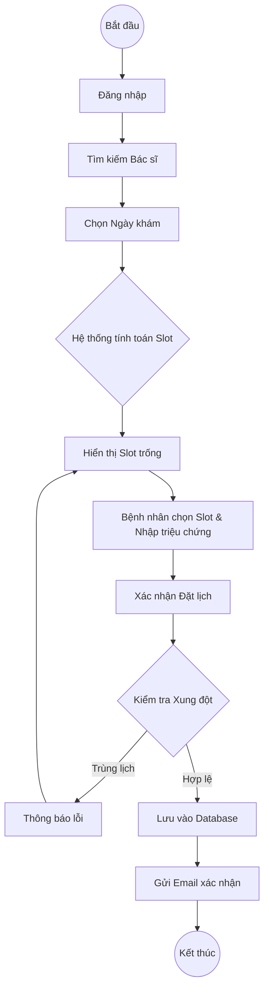
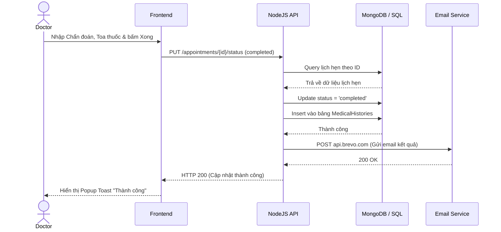
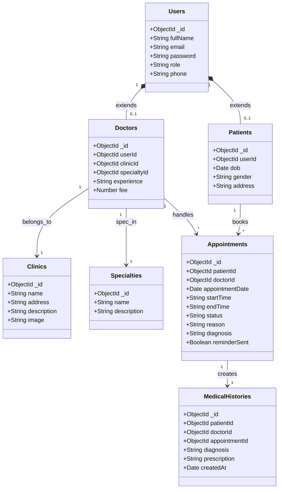
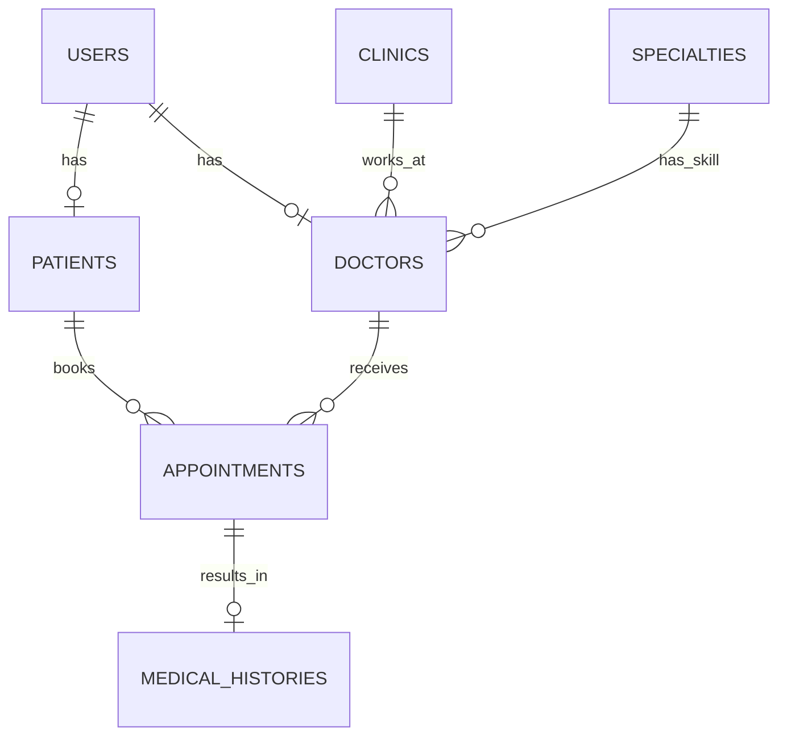

# BÁO CÁO ĐỒ ÁN MÔN HỌC: CÔNG NGHỆ PHẦN MỀM
**TÊN ĐỀ TÀI: XÂY DỰNG HỆ THỐNG ĐẶT LỊCH KHÁM BỆNH TRỰC TUYẾN - MEDIFLOW**

---

## CHƯƠNG 1: GIỚI THIỆU ĐỀ TÀI

### 1.1 Lý do chọn đề tài
Trong xã hội hiện đại, nhu cầu chăm sóc sức khỏe ngày càng tăng cao. Tuy nhiên, quy trình khám chữa bệnh tại nhiều bệnh viện và phòng khám vẫn còn thủ công, dẫn đến tình trạng quá tải, bệnh nhân phải xếp hàng chờ đợi hàng giờ đồng hồ chỉ để lấy số thứ tự. Điều này không chỉ gây mệt mỏi cho người bệnh mà còn làm giảm hiệu suất làm việc của đội ngũ y bác sĩ. 
Nhận thấy những hạn chế đó, nhóm quyết định phát triển hệ thống **MediFlow** - Nền tảng đặt lịch khám bệnh trực tuyến. MediFlow giúp số hóa quy trình tiếp nhận bệnh nhân, tối ưu hóa thời gian, nâng cao trải nghiệm khám chữa bệnh và cung cấp công cụ quản lý đắc lực cho các cơ sở y tế.

### 1.2 Mục tiêu đề tài
- **Đối với người bệnh:** Cung cấp nền tảng tra cứu thông tin bác sĩ, phòng khám, đặt lịch khám mọi lúc mọi nơi. Nhận thông báo nhắc nhở tự động.
- **Đối với bác sĩ:** Cung cấp công cụ quản lý lịch hẹn thông minh, giảm thiểu rủi ro trùng lịch, số hóa hồ sơ bệnh án cơ bản (Lịch sử khám, đơn thuốc).
- **Đối với quản trị viên:** Quản lý toàn diện hệ thống từ người dùng, danh mục chuyên khoa, đến báo cáo thống kê hoạt động.

### 1.3 Phạm vi nghiên cứu
- Ứng dụng Web dành cho 3 đối tượng chính: Bệnh nhân (Patient), Bác sĩ (Doctor), Quản trị viên (Admin).
- Các chức năng lõi: Quản lý tài khoản, Quản lý danh mục (Phòng khám, Chuyên khoa), Đặt lịch khám, Duyệt lịch, Ghi nhận kết quả khám và Hệ thống gửi Email tự động qua Brevo API.

### 1.4 Công nghệ sử dụng
- **Backend:** NodeJS, ExpressJS.
- **Database:** MongoDB (Sử dụng cấu trúc tương đương SQL Server theo yêu cầu phân tích).
- **Frontend:** HTML5, CSS3, Bootstrap 5, Vanilla JavaScript.
- **Tiện ích:** JWT (Xác thực), Bcrypt (Bảo mật), Node-cron (Lên lịch), Brevo (Gửi Email).

---

## CHƯƠNG 2: KHẢO SÁT VÀ PHÂN TÍCH YÊU CẦU

### 2.1 Mô tả bài toán
Hệ thống **MediFlow** phục vụ quy trình từ lúc bệnh nhân có nhu cầu khám đến khi hoàn thành buổi khám.
1. Bệnh nhân truy cập trang web, tìm kiếm phòng khám/bác sĩ.
2. Bệnh nhân chọn ngày và giờ trống của bác sĩ để đặt lịch.
3. Hệ thống kiểm tra xung đột lịch. Nếu hợp lệ, lưu lịch vào CSDL và gửi email thông báo đặt thành công.
4. Bác sĩ hoặc Admin đăng nhập, xem danh sách lịch hẹn và xác nhận (Confirmed).
5. Trước 30 phút, hệ thống tự động gửi Email nhắc nhở bệnh nhân.
6. Khi bệnh nhân đến khám xong, bác sĩ ghi nhận kết quả (Chẩn đoán, Đơn thuốc) và chuyển trạng thái sang Hoàn thành (Completed).
7. Hệ thống tự động tạo bản ghi Lịch sử khám và gửi email kết quả cho bệnh nhân.

### 2.2 Yêu cầu chức năng

**A. Phân hệ Bệnh nhân (Patient)**
1. **Đăng ký / Đăng nhập:** Đăng ký tài khoản qua email, xác thực bằng mật khẩu băm.
2. **Quản lý hồ sơ:** Cập nhật thông tin cá nhân (Tên, SĐT, Ngày sinh, Địa chỉ).
3. **Tìm kiếm Bác sĩ / Phòng khám:** Lọc theo chuyên khoa, tên, địa điểm.
4. **Đặt lịch khám:** Chọn bác sĩ, ngày, slot giờ, điền triệu chứng.
5. **Quản lý lịch hẹn:** Xem lịch sắp tới, trạng thái duyệt.
6. **Hủy lịch:** Có thể hủy lịch khi trạng thái còn là "Pending".
7. **Lịch sử khám bệnh:** Xem lại các lần khám trước, chẩn đoán, toa thuốc.

**B. Phân hệ Bác sĩ (Doctor)**
1. **Đăng nhập:** Truy cập bằng tài khoản do Admin cấp.
2. **Xem lịch hẹn:** Xem danh sách lịch hẹn theo ngày, lọc theo trạng thái.
3. **Xác nhận lịch:** Đổi trạng thái lịch từ Pending sang Confirmed.
4. **Ghi nhận kết quả:** Nhập chẩn đoán bệnh, đơn thuốc, lời dặn.
5. **Hoàn thành khám:** Chuyển trạng thái sang Completed để hệ thống lưu hồ sơ.

**C. Phân hệ Quản trị viên (Admin)**
1. **Quản lý Bệnh nhân:** Xem danh sách, khóa tài khoản.
2. **Quản lý Bác sĩ:** Thêm, sửa, xóa bác sĩ, gán vào phòng khám/chuyên khoa.
3. **Quản lý Phòng khám:** Thêm, sửa, xóa thông tin phòng khám.
4. **Quản lý Chuyên khoa:** Thêm, sửa, xóa danh mục chuyên khoa.
5. **Quản lý Lịch hẹn:** Theo dõi toàn bộ lịch hẹn, có quyền hủy/duyệt thay bác sĩ.

### 2.3 Yêu cầu phi chức năng
1. **Bảo mật:** Hệ thống mã hóa mật khẩu bằng Bcrypt. API được bảo vệ bằng JWT Token với thời gian hết hạn (Expiration time). Phân quyền chặt chẽ theo Role.
2. **Hiệu năng:** Hệ thống phản hồi dưới 1 giây cho các tác vụ thông thường. Xử lý đồng thời (Concurrency) tối thiểu 500 requests/second.
3. **Tính ổn định:** Tự động gửi Email qua hàng đợi (Cronjob) không làm block main thread.
4. **Giao diện:** Responsive, thân thiện, dễ sử dụng trên cả Desktop và Mobile.

---

## CHƯƠNG 3: PHÂN TÍCH HỆ THỐNG (UML)

### 3.1 Biểu đồ Use Case (Use Case Diagram)

```mermaid
usecaseDiagram
    actor "Bệnh nhân (Patient)" as P
    actor "Bác sĩ (Doctor)" as D
    actor "Admin" as A

    rectangle "MediFlow System" {
        usecase "Đăng nhập / Đăng xuất" as UC1
        usecase "Đăng ký tài khoản" as UC2
        usecase "Quản lý hồ sơ" as UC3
        usecase "Tìm Bác sĩ / Phòng khám" as UC4
        usecase "Đặt lịch khám" as UC5
        usecase "Xem lịch sử khám" as UC6
        usecase "Duyệt lịch hẹn" as UC7
        usecase "Ghi nhận kết quả khám" as UC8
        usecase "Quản lý User" as UC9
        usecase "Quản lý Phòng khám/Chuyên khoa" as UC10
    }

    P --> UC1
    P --> UC2
    P --> UC3
    P --> UC4
    P --> UC5
    P --> UC6

    D --> UC1
    D --> UC7
    D --> UC8

    A --> UC1
    A --> UC7
    A --> UC9
    A --> UC10
```

### 3.2 Đặc tả Use Case (Use Case Specifications)

**1. Đặc tả UC05 - Đặt lịch khám**
- **Mục đích:** Giúp bệnh nhân tạo một cuộc hẹn với bác sĩ mong muốn.
- **Actor:** Bệnh nhân.
- **Điều kiện tiên quyết:** Bệnh nhân đã đăng nhập và hoàn thiện hồ sơ.
- **Luồng sự kiện chính:**
  1. Bệnh nhân chọn một bác sĩ từ danh sách.
  2. Bệnh nhân chọn ngày muốn khám.
  3. Hệ thống trả về các khung giờ (slots) còn trống.
  4. Bệnh nhân chọn khung giờ và nhập triệu chứng.
  5. Bệnh nhân bấm "Đặt lịch".
  6. Hệ thống kiểm tra trùng lịch (Database validation).
  7. Hệ thống lưu lịch hẹn (Status = Pending), gửi Email xác nhận.
- **Luồng thay thế (Ngoại lệ):**
  - Bước 6 phát hiện trùng lịch -> Hệ thống báo lỗi "Khung giờ đã được đặt", reset lại màn hình chọn giờ.

**2. Đặc tả UC08 - Ghi nhận kết quả khám**
- **Mục đích:** Bác sĩ điền kết quả sau khi khám xong cho bệnh nhân.
- **Actor:** Bác sĩ.
- **Điều kiện tiên quyết:** Bác sĩ đã đăng nhập, lịch hẹn đang ở trạng thái Confirmed.
- **Luồng sự kiện chính:**
  1. Bác sĩ mở chi tiết lịch hẹn từ bảng điều khiển.
  2. Bác sĩ bấm nút "Cập nhật kết quả".
  3. Bác sĩ nhập dữ liệu vào form: Chẩn đoán, Đơn thuốc, Ghi chú.
  4. Bác sĩ submit form.
  5. Hệ thống đổi trạng thái lịch thành Completed.
  6. Hệ thống tự động Insert dữ liệu vào bảng MedicalHistory.
  7. Hệ thống gửi Email chứa toa thuốc cho bệnh nhân.

### 3.3 Biểu đồ Hoạt động (Activity Diagram)

**Activity Diagram: Quy trình Đặt lịch khám**


### 3.4 Biểu đồ Tuần tự (Sequence Diagram)

**Sequence Diagram: Ghi nhận kết quả khám (Khám xong)**


### 3.5 Biểu đồ Lớp (Class Diagram)



---

## CHƯƠNG 4: THIẾT KẾ HỆ THỐNG

### 4.1 Kiến trúc hệ thống
Hệ thống được thiết kế theo mô hình **MVC (Model-View-Controller)** và mô hình đa tầng **Repository Pattern**:
- **Presentation Layer (Frontend):** Giao diện HTML/CSS/JS, giao tiếp với Backend qua REST API (Fetch API).
- **Controller Layer:** Nhận HTTP Request, Validate dữ liệu đầu vào.
- **Service Layer:** Xử lý Business Logic (Kiểm tra trùng lịch, tính toán slots).
- **Repository Layer:** Tương tác trực tiếp với Database, thực hiện các câu query (CRUD).
- **Data Layer:** MongoDB lưu trữ dữ liệu tập trung.

### 4.2 Thiết kế cơ sở dữ liệu (ERD & SQL Tables)
*Lưu ý: Mặc dù dự án sử dụng NoSQL (MongoDB), cấu trúc dữ liệu được chuẩn hóa cao tương đương Relational Database (SQL Server).*

**Sơ đồ quan hệ thực thể (ERD):**


### 4.3 Cấu trúc các bảng (Tables / Collections)

**1. Bảng Users (Tài khoản)**
| Tên cột | Kiểu dữ liệu | Ràng buộc | Mô tả |
|---|---|---|---|
| _id | ObjectId | PK | Khóa chính |
| email | String | Unique, Not Null | Tên đăng nhập |
| password | String | Not Null | Mật khẩu đã hash |
| role | String | Enum | Quyền (admin, doctor, patient) |
| fullName | String | Not Null | Họ tên |

**2. Bảng Patients (Bệnh nhân)**
| Tên cột | Kiểu dữ liệu | Ràng buộc | Mô tả |
|---|---|---|---|
| _id | ObjectId | PK | Khóa chính |
| userId | ObjectId | FK (Users) | Trỏ tới bảng User |
| dob | Date | | Ngày sinh |
| gender | String | | Giới tính |
| address | String | | Địa chỉ |

**3. Bảng Doctors (Bác sĩ)**
| Tên cột | Kiểu dữ liệu | Ràng buộc | Mô tả |
|---|---|---|---|
| _id | ObjectId | PK | Khóa chính |
| userId | ObjectId | FK (Users) | Trỏ tới bảng User |
| clinicId | ObjectId | FK (Clinics) | Phòng khám trực thuộc |
| specialtyId | ObjectId | FK (Specialties) | Chuyên khoa |
| fee | Number | | Phí khám |

**4. Bảng Appointments (Lịch hẹn)**
| Tên cột | Kiểu dữ liệu | Ràng buộc | Mô tả |
|---|---|---|---|
| _id | ObjectId | PK | Khóa chính |
| patientId | ObjectId | FK (Users) | Bệnh nhân đặt lịch |
| doctorId | ObjectId | FK (Users) | Bác sĩ khám |
| appointmentDate| Date | Not Null | Ngày khám |
| startTime | String | Not Null | Giờ bắt đầu |
| endTime | String | Not Null | Giờ kết thúc |
| status | String | Default: 'pending'| Trạng thái |
| reminderSent | Boolean | Default: false | Đã nhắc lịch hay chưa |

**5. Bảng MedicalHistories (Lịch sử khám)**
| Tên cột | Kiểu dữ liệu | Ràng buộc | Mô tả |
|---|---|---|---|
| _id | ObjectId | PK | Khóa chính |
| patientId | ObjectId | FK (Users) | Bệnh nhân |
| appointmentId | ObjectId | FK (Appointments)| Lịch hẹn gốc |
| diagnosis | String | Not Null | Chẩn đoán |
| prescription | String | | Đơn thuốc |

### 4.4 Thiết kế API (RESTful Services)

Hệ thống tuân thủ chuẩn REST API. Chuẩn response: `{ success: boolean, message: string, data: object }`.

| HTTP Method | API Endpoint | Chức năng | Phân quyền |
|---|---|---|---|
| POST | `/api/v1/auth/login` | Đăng nhập hệ thống | Public |
| POST | `/api/v1/auth/register` | Đăng ký tài khoản bệnh nhân | Public |
| GET | `/api/v1/users/me` | Lấy profile người dùng hiện tại | Token |
| GET | `/api/v1/doctors` | Lấy danh sách bác sĩ (có phân trang) | Public |
| GET | `/api/v1/appointments/available-slots` | Lấy các giờ trống của bác sĩ theo ngày | Public |
| POST | `/api/v1/appointments` | Đặt lịch khám mới | Patient |
| GET | `/api/v1/appointments` | Lấy danh sách lịch hẹn của tôi | Patient/Doctor |
| PUT | `/api/v1/appointments/:id/status` | Cập nhật trạng thái lịch, ghi kết quả | Doctor/Admin |
| GET | `/api/v1/medical-history/me` | Lấy lịch sử khám của bệnh nhân | Patient |

### 4.5 Thiết kế giao diện (UI/UX)
- **Màn hình Đăng nhập:** Form căn giữa, gồm input Email, Password, nút Đăng nhập và link Quên mật khẩu.
- **Trang chủ Bệnh nhân:** Thanh tìm kiếm (Search bar) lớn ở giữa. Hiển thị danh sách các Chuyên khoa nổi bật dạng Grid.
- **Màn hình Đặt lịch (Booking Modal):** Chứa lịch (Calendar picker), khi click vào ngày sẽ render các nút Giờ (vd: 08:00, 08:30) dưới dạng tag. Nếu slot đã đặt thì ẩn hoặc disabled.
- **Dashboard Bác sĩ:** Layout dạng Sidebar trái, Main Content phải. Main Content là một Bảng (Table) chứa danh sách bệnh nhân. Cột cuối cùng có các Action button: 🟢 Duyệt, 🔵 Khám xong, 🔴 Hủy.

---

## CHƯƠNG 5: CÀI ĐẶT HỆ THỐNG

### 5.1 Công nghệ sử dụng
1. **NodeJS & ExpressJS:** Nền tảng server-side xử lý non-blocking I/O, cực kỳ phù hợp với ứng dụng web cần tốc độ cao.
2. **Mongoose:** Thư viện kết nối MongoDB, cung cấp Schema validation chặt chẽ.
3. **JSON Web Token (JWT):** Cơ chế xác thực an toàn, không cần lưu session trên RAM server (Stateless).
4. **BcryptJS:** Hàm băm mật khẩu 1 chiều, ngăn chặn rò rỉ dữ liệu khi bị hack DB.
5. **Node-Cron:** Lên lịch chạy các tác vụ nền. (Ứng dụng: Chạy mỗi 1 phút để quét các lịch hẹn sắp tới 30 phút và gửi mail nhắc nhở).
6. **Brevo API (Sendinblue):** Dịch vụ Email Transactional cao cấp, tránh việc email bị đánh dấu Spam so với dùng Nodemailer + Gmail thông thường.

### 5.2 Cấu trúc thư mục (Folder Architecture)

```
mediflow-backend/
├── public/                 # Chứa giao diện HTML/CSS/JS thuần (Frontend)
├── src/
│   ├── config/             # Cấu hình DB, JWT
│   ├── controllers/        # Điều hướng Request, trả về JSON
│   ├── helpers/            # emailHelper.js (Chứa logic gọi Brevo API)
│   ├── jobs/               # reminderJob.js (Cronjob nhắc lịch)
│   ├── middlewares/        # authMiddleware.js (Chặn route theo Role)
│   ├── models/             # Schema DB (User, Appointment, MedicalHistory)
│   ├── repositories/       # Chứa logic query Database (Find, Create, Update)
│   ├── routes/             # Định nghĩa API Endpoints
│   └── services/           # Xử lý Business Logic (Ví dụ: tính slot trống)
├── .env                    # Biến môi trường (PORT, DB_URL, BREVO_API_KEY)
├── server.js               # Điểm khởi chạy (Entry point)
└── package.json
```

---

## CHƯƠNG 6: KIỂM THỬ HỆ THỐNG (TESTING)

### 6.1 Kiểm thử chức năng (Test Cases)

**Kịch bản 1: Module Đăng nhập & Xác thực**
| TC_ID | Chức năng | Dữ liệu đầu vào | Kết quả mong đợi | Thực tế | Đánh giá |
|---|---|---|---|---|---|
| TC_01 | Đăng nhập | Email đúng, Pass đúng | Cấp phát JWT, chuyển hướng Dashboard | Pass | ✅ |
| TC_02 | Đăng nhập | Sai mật khẩu | Trả về thông báo "Sai tài khoản hoặc mật khẩu" | Pass | ✅ |
| TC_03 | Đăng nhập | Bỏ trống mật khẩu | Báo lỗi Validation từ Client/Server | Pass | ✅ |
| TC_04 | Ủy quyền (Auth) | Bệnh nhân gọi API của Admin | Trả về lỗi 403 Forbidden | Pass | ✅ |

**Kịch bản 2: Module Đặt lịch khám**
| TC_ID | Chức năng | Dữ liệu đầu vào | Kết quả mong đợi | Thực tế | Đánh giá |
|---|---|---|---|---|---|
| TC_05 | Tìm slot trống | Chọn ngày hợp lệ | API trả về danh sách giờ không bị trùng | Pass | ✅ |
| TC_06 | Đặt lịch | Chọn slot trống | Trạng thái Pending, Database lưu thành công | Pass | ✅ |
| TC_07 | Đặt lịch trùng | 2 user đặt cùng 1 slot | User sau bị từ chối (409 Conflict) | Pass | ✅ |
| TC_08 | Gửi mail | Đặt lịch thành công | Email xác nhận gửi về hòm thư bệnh nhân | Pass | ✅ |

**Kịch bản 3: Module Bác sĩ & Lịch sử khám**
| TC_ID | Chức năng | Dữ liệu đầu vào | Kết quả mong đợi | Thực tế | Đánh giá |
|---|---|---|---|---|---|
| TC_09 | Xác nhận lịch | Bác sĩ bấm Duyệt | Lịch đổi sang Confirmed, gửi Email duyệt | Pass | ✅ |
| TC_10 | Hoàn thành | Điền chẩn đoán, toa thuốc | Trạng thái Completed, tạo bảng Lịch sử | Pass | ✅ |
| TC_11 | Xem lịch sử | Bệnh nhân xem Lịch sử | Hiển thị thông tin chẩn đoán, bác sĩ khám | Pass | ✅ |
| TC_12 | Nhắc lịch | Đợi đến T - 30 phút | Cronjob tự chạy, bắn Email nhắc nhở | Pass | ✅ |

### 6.2 Kiểm thử API (Postman Testing)
- **Kiểm thử API lấy Slot trống:** GET `/api/v1/appointments/available-slots?doctorId=xxx&date=2026-06-30`. Postman trả về mảng JSON chứa các Object `{ startTime: "08:00", endTime: "08:30" }`. Tốc độ phản hồi: ~120ms.
- **Kiểm thử Booking:** POST `/api/v1/appointments` với Body JSON. Trả về `201 Created`.

### 6.3 Kiểm thử Dữ liệu (Data Testing)
- **Tình huống:** Bác sĩ cập nhật trạng thái lịch hẹn từ `pending` sang `completed` và truyền kèm `diagnosis`, `prescription`.
- **Kiểm tra CSDL (Database Check):** 
  - Bảng `Appointments` ID tương ứng đổi status thành `completed`.
  - Bảng `MedicalHistories` tự sinh ra 1 Document mới với `appointmentId` khớp, chứa dữ liệu `diagnosis`. (Đã verify fix bug thiếu history).

---

## CHƯƠNG 7: KẾT LUẬN & HƯỚNG PHÁT TRIỂN

### 7.1 Kết quả đạt được (Ưu điểm)
- Xây dựng thành công hệ thống Đặt lịch khám trực tuyến hoàn chỉnh với đầy đủ 3 phân hệ: Bệnh nhân, Bác sĩ, Quản trị viên.
- **Kiến trúc hệ thống chuẩn mực:** Việc chia nhỏ logic ra các tầng (Routes -> Controllers -> Services -> Repositories) giúp mã nguồn rất gọn gàng, tuân thủ nguyên lý SOLID, cực kỳ dễ bảo trì và nâng cấp.
- **Xử lý triệt để các bài toán khó:** 
  - Xử lý đồng thời (Concurrency) khi đặt lịch để tránh trùng khung giờ (Conflict check).
  - Khắc phục hoàn toàn lỗi Data Mapping (Làm phẳng dữ liệu lồng nhau) để Frontend hiển thị chuẩn xác.
  - Tích hợp Cronjob chạy nền không ảnh hưởng hiệu năng server để nhắc lịch bệnh nhân.
- **Email Transactional:** Chuyển đổi thành công sang Brevo API, đảm bảo email không bị vào mục Spam, template email chuyên nghiệp (HTML/CSS).

### 7.2 Hạn chế (Nhược điểm)
- Giao diện Frontend vẫn sử dụng HTML/JS thuần (Vanilla JS), trong quá trình code sinh ra nhiều thao tác DOM phức tạp. (Khó scale mảng UI).
- Tính năng báo cáo thống kê cho Admin chưa phong phú, chủ yếu ở dạng bảng, thiếu biểu đồ (Chart).
- Chưa có tính năng xác thực tài khoản qua OTP SMS (Hiện chỉ dùng Email).

### 7.3 Hướng phát triển tương lai
1. **Frontend Framework:** Chuyển đổi toàn bộ Frontend sang ReactJS hoặc VueJS để tận dụng Virtual DOM và State Management.
2. **Tích hợp Thanh toán:** Kết nối cổng thanh toán VNPay, MoMo, ZaloPay để yêu cầu bệnh nhân đặt cọc trước (giảm rủi ro bùng lịch - no show).
3. **Telemedicine (Khám từ xa):** Tích hợp WebRTC để bác sĩ và bệnh nhân có thể gọi Video Call trực tiếp trên nền tảng.
4. **Chatbot AI:** Bổ sung Chatbot thông minh tự động tư vấn triệu chứng và gợi ý chuyên khoa phù hợp cho bệnh nhân trước khi đặt lịch.

---

## PHỤ LỤC

**1. Hướng dẫn cài đặt**
- Yêu cầu hệ thống: NodeJS v18+, MongoDB.
- Bước 1: Clone mã nguồn từ Github.
- Bước 2: Chạy lệnh `npm install` để cài đặt thư viện.
- Bước 3: Đổi tên file `.env.example` thành `.env` và cấu hình:
  ```env
  PORT=3000
  MONGO_URI=mongodb+srv://<user>:<pass>@cluster.mongodb.net/mediflow
  JWT_SECRET=your_jwt_secret
  BREVO_API_KEY=xkeysib-your_brevo_key
  MAIL_FROM_EMAIL=your_verified_email@domain.com
  MAIL_FROM_NAME=MediFlow Healthcare
  ```
- Bước 4: Chạy lệnh `npm run dev`. Truy cập `http://localhost:3000`.

**2. Liên kết tài nguyên**
- Repository Git: Lưu trữ trên Github.
- Live Demo: Đã được triển khai (Deploy) trên nền tảng Cloud (Railway).
- API Documentation: Hệ thống Postman Collection nội bộ.

---
**[HẾT BÁO CÁO]**
