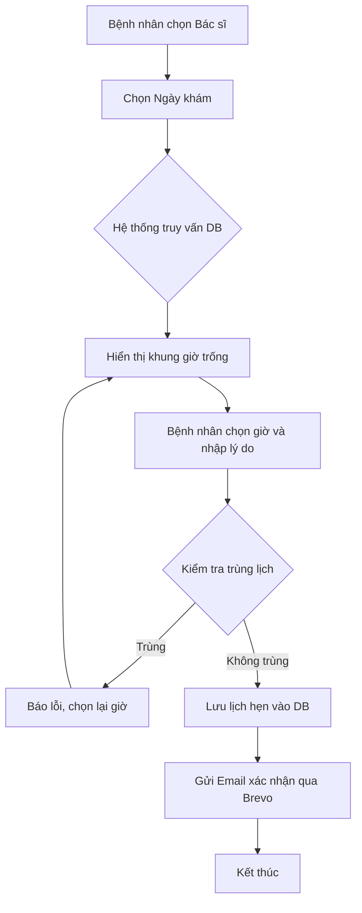
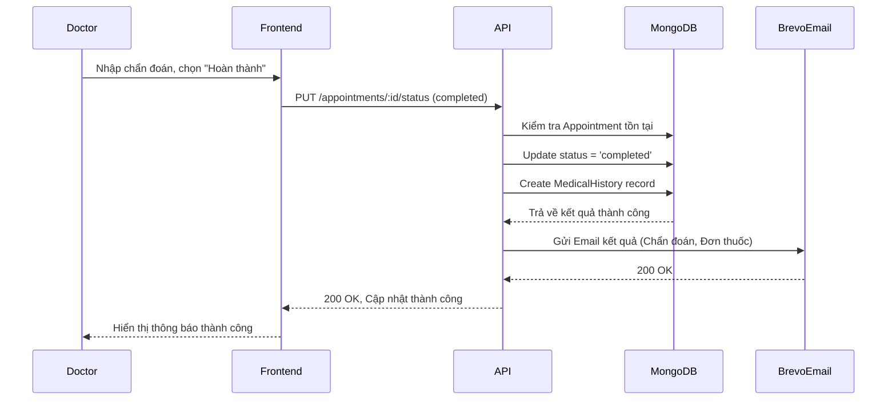
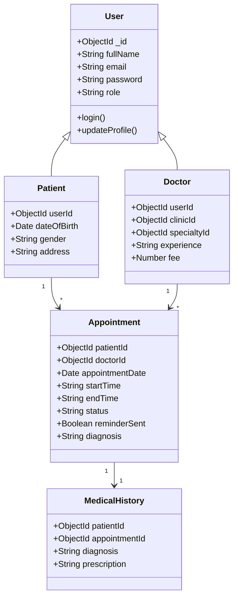
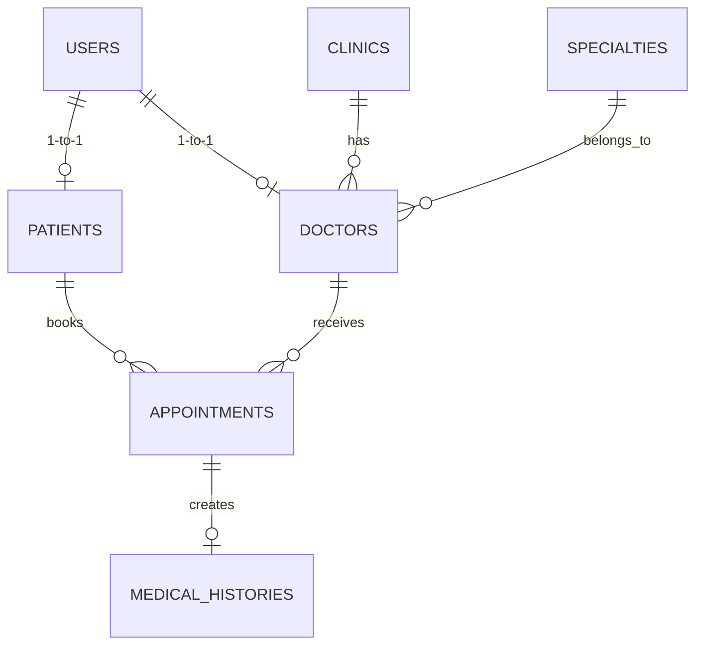

# BÁO CÁO ĐỒ ÁN MÔN HỌC: CÔNG NGHỆ PHẦN MỀM
**TÊN ĐỀ TÀI: XÂY DỰNG HỆ THỐNG ĐẶT LỊCH KHÁM BỆNH TRỰC TUYẾN - MEDIFLOW**

---

## Chương 1. Giới thiệu đề tài

### 1.1 Lý do chọn đề tài
Trong thời đại công nghệ số, việc chuyển đổi số trong lĩnh vực y tế đang trở thành một nhu cầu cấp thiết. Tại nhiều bệnh viện và phòng khám hiện nay, người bệnh thường xuyên phải đối mặt với tình trạng xếp hàng chờ đợi lâu, thủ tục giấy tờ rườm rà. Hệ thống "MediFlow" được ra đời nhằm giải quyết vấn đề này, cung cấp nền tảng kết nối trực tiếp giữa Bệnh nhân và Bác sĩ/Phòng khám một cách nhanh chóng, tiện lợi, giúp tối ưu hóa quy trình khám chữa bệnh.

### 1.2 Mục tiêu đề tài
- Xây dựng hệ thống web cho phép người bệnh tìm kiếm phòng khám, bác sĩ và đặt lịch khám online.
- Quản lý lịch trình làm việc của bác sĩ một cách tự động, tránh tình trạng trùng lịch.
- Cung cấp hệ thống quản trị (Admin) để quản lý toàn bộ dữ liệu hệ thống (Người dùng, Phòng khám, Chuyên khoa).
- Tích hợp hệ thống thông báo qua Email để nhắc lịch khám tự động.

### 1.3 Phạm vi nghiên cứu
- **Quy mô**: Hệ thống tập trung vào nghiệp vụ đặt lịch khám ngoại trú tại các phòng khám tư nhân hoặc bệnh viện đa khoa.
- **Giới hạn**: Hệ thống hiện tại tập trung vào quy trình đặt lịch, quản lý lịch sử khám, chưa tích hợp thanh toán trực tuyến (Payment Gateway).

### 1.4 Đối tượng sử dụng
- **Người bệnh (Patient)**: Người có nhu cầu tìm kiếm và đặt lịch khám y tế.
- **Bác sĩ (Doctor)**: Chuyên gia y tế cần quản lý lịch hẹn và trả kết quả khám.
- **Quản trị viên (Admin)**: Người điều hành hệ thống, quản lý dữ liệu nền tảng.

### 1.5 Công nghệ sử dụng
- **Backend**: NodeJS, ExpressJS.
- **Database**: MongoDB (Mongoose) *(Lưu ý: Hệ thống thực tế dùng NoSQL MongoDB thay vì SQL Server truyền thống để tăng tốc độ phát triển và tính linh hoạt).*
- **Frontend**: HTML5, CSS3, JavaScript thuần, Bootstrap.
- **Dịch vụ tích hợp**: Brevo API (Gửi email), Node-cron (Lên lịch nhắc nhở).

### 1.6 Cấu trúc báo cáo
Báo cáo gồm 7 chương: Giới thiệu đề tài, Phân tích yêu cầu, Phân tích hệ thống (UML), Thiết kế hệ thống, Cài đặt hệ thống, Kiểm thử và Kết luận.

---

## Chương 2. Khảo sát và phân tích yêu cầu

### 2.1 Mô tả bài toán
Người bệnh truy cập vào hệ thống, đăng ký tài khoản. Khi có nhu cầu khám, người bệnh có thể tìm kiếm bác sĩ theo chuyên khoa hoặc phòng khám. Sau khi chọn bác sĩ, hệ thống hiển thị khung giờ trống. Người bệnh chọn giờ và xác nhận đặt lịch. Hệ thống gửi email xác nhận. Bác sĩ xem danh sách lịch hẹn trong ngày và tiến hành khám. Sau khi khám xong, bác sĩ điền chẩn đoán, toa thuốc và đánh dấu hoàn thành. Hệ thống lưu vào lịch sử khám và gửi email kết quả cho người bệnh.

### 2.2 Yêu cầu chức năng
**Người bệnh (Patient):**
- Đăng ký, đăng nhập hệ thống.
- Xem và cập nhật hồ sơ cá nhân.
- Tìm kiếm phòng khám, chuyên khoa, bác sĩ.
- Đặt lịch hẹn, hủy lịch hẹn.
- Xem danh sách lịch hẹn sắp tới.
- Xem lịch sử khám bệnh (kết quả chẩn đoán, đơn thuốc).
- Nhận email nhắc lịch khám trước 30 phút.

**Bác sĩ (Doctor):**
- Đăng nhập (tài khoản do admin cấp).
- Xem danh sách lịch hẹn của mình.
- Cập nhật trạng thái lịch hẹn (Pending -> Confirmed -> Completed).
- Nhập kết quả chẩn đoán, đơn thuốc sau khi khám xong.
- Xem thống kê số lượng bệnh nhân theo ngày.

**Quản trị viên (Admin):**
- Quản lý tài khoản (Users, Doctors, Patients).
- Quản lý Phòng khám (Clinics) và Chuyên khoa (Specialties).
- Quản lý toàn bộ Lịch hẹn (Appointments).
- Xem báo cáo, thống kê tổng quan hệ thống.

### 2.3 Yêu cầu phi chức năng
- **Bảo mật**: Sử dụng JWT để mã hóa phiên đăng nhập. Mật khẩu phải được băm (bcrypt) trước khi lưu.
- **Cơ sở dữ liệu**: MongoDB (NoSQL) đáp ứng tốc độ truy xuất cao, thiết kế schema rõ ràng.
- **Hiệu năng**: Thời gian phản hồi API < 500ms.
- **Tính khả dụng**: Giao diện Responsive hoạt động tốt trên cả PC và Mobile.
- **Tính mở rộng**: Kiến trúc module hóa (MVC) dễ dàng bảo trì và thêm tính năng sau này.

---

## Chương 3. Phân tích hệ thống

### 3.1 Use Case Diagram

```mermaid
usecaseDiagram
    actor Patient
    actor Doctor
    actor Admin

    Patient --> (Đăng ký/Đăng nhập)
    Patient --> (Quản lý hồ sơ)
    Patient --> (Tìm kiếm Bác sĩ/Phòng khám)
    Patient --> (Đặt lịch khám)
    Patient --> (Xem/Hủy lịch hẹn)
    Patient --> (Xem lịch sử khám)

    Doctor --> (Đăng nhập)
    Doctor --> (Xem danh sách lịch hẹn)
    Doctor --> (Xác nhận lịch hẹn)
    Doctor --> (Ghi nhận kết quả khám)
    Doctor --> (Xem thống kê cá nhân)

    Admin --> (Đăng nhập)
    Admin --> (Quản lý Bác sĩ/Bệnh nhân)
    Admin --> (Quản lý Phòng khám/Chuyên khoa)
    Admin --> (Quản lý Lịch hẹn toàn hệ thống)
```

### 3.2 Đặc tả Use Case

**UC01: Đặt lịch khám**
- **Mục đích**: Cho phép bệnh nhân tạo một cuộc hẹn với bác sĩ.
- **Actor**: Patient.
- **Điều kiện trước**: Patient đã đăng nhập và đã điền đầy đủ hồ sơ.
- **Luồng chính**:
  1. Bệnh nhân chọn Bác sĩ và ngày muốn khám.
  2. Hệ thống hiển thị các khung giờ trống của bác sĩ đó.
  3. Bệnh nhân chọn khung giờ, điền lý do/triệu chứng.
  4. Hệ thống kiểm tra xung đột lịch (Conflict check).
  5. Hệ thống lưu lịch hẹn (status = 'pending') và gửi Email xác nhận.
- **Luồng phụ**: Khung giờ đã bị đặt (do trễ thao tác) -> Hệ thống báo lỗi và yêu cầu chọn lại.
- **Điều kiện sau**: Lịch hẹn xuất hiện trong danh sách của Bệnh nhân và Bác sĩ.

**UC02: Ghi nhận kết quả khám**
- **Mục đích**: Bác sĩ hoàn tất ca khám và lưu hồ sơ y tế.
- **Actor**: Doctor.
- **Điều kiện trước**: Lịch hẹn đang ở trạng thái 'confirmed'.
- **Luồng chính**:
  1. Bác sĩ mở chi tiết lịch hẹn.
  2. Bác sĩ nhập Chẩn đoán, Đơn thuốc, Lời dặn.
  3. Bác sĩ chọn cập nhật trạng thái sang "Hoàn thành" (Completed).
  4. Hệ thống lưu cập nhật, tự động tạo bản ghi vào `MedicalHistory`.
  5. Hệ thống gửi Email kết quả cho Bệnh nhân.

### 3.3 Activity Diagram (Quy trình đặt lịch)



### 3.4 Sequence Diagram (Ghi nhận kết quả khám)



### 3.5 Class Diagram



---

## Chương 4. Thiết kế hệ thống

### 4.1 Kiến trúc hệ thống
Hệ thống tuân thủ kiến trúc **Client-Server** áp dụng mô hình thiết kế **MVC / 3-Tier** ở phía Backend:
`Browser (HTML/JS)` ➡️ `Express Router` ➡️ `Controllers` ➡️ `Services (Nghiệp vụ)` ➡️ `Repositories (Truy xuất DB)` ➡️ `MongoDB`.

### 4.2 Thiết kế Database (ERD)



### 4.3 Thiết kế Schema (Cấu trúc Bảng/Collection)

1. **Users** (Quản lý tài khoản)
   - `_id`: ObjectId (PK)
   - `email`: String (Unique)
   - `password`: String (Bcrypt Hash)
   - `role`: Enum ('admin', 'doctor', 'patient')
   - `fullName`: String
   - `phone`: String

2. **Doctors** (Thông tin Bác sĩ)
   - `_id`: ObjectId (PK)
   - `userId`: ObjectId (FK -> Users)
   - `clinicId`: ObjectId (FK -> Clinics)
   - `specialtyId`: ObjectId (FK -> Specialties)
   - `experience`: String
   - `fee`: Number

3. **Appointments** (Lịch hẹn)
   - `_id`: ObjectId (PK)
   - `patientId`: ObjectId (FK -> Users)
   - `doctorId`: ObjectId (FK -> Users)
   - `appointmentDate`: Date
   - `startTime`: String
   - `endTime`: String
   - `status`: Enum ('pending', 'confirmed', 'completed', 'cancelled')
   - `reason`: String
   - `diagnosis`: String
   - `reminderSent`: Boolean

4. **MedicalHistories** (Lịch sử khám)
   - `_id`: ObjectId (PK)
   - `patientId`: ObjectId (FK -> Users)
   - `appointmentId`: ObjectId (FK -> Appointments)
   - `doctorId`: ObjectId (FK -> Users)
   - `diagnosis`: String
   - `prescription`: String

### 4.4 Thiết kế API (RESTful)

| API Endpoint | HTTP Method | Mô tả chức năng | Middleware (Role) |
|---|---|---|---|
| `/api/v1/auth/login` | POST | Xác thực và cấp phát JWT | Public |
| `/api/v1/auth/register` | POST | Đăng ký tài khoản bệnh nhân | Public |
| `/api/v1/appointments` | POST | Đặt lịch khám mới | auth (Patient) |
| `/api/v1/appointments/:id/status` | PUT | Bác sĩ/Admin duyệt, hoàn thành, hủy lịch | auth (Doctor, Admin) |
| `/api/v1/medical-history/me` | GET | Lấy lịch sử khám của bệnh nhân đang login | auth (Patient) |
| `/api/v1/admin/patients` | GET | Lấy danh sách toàn bộ bệnh nhân | auth (Admin) |

### 4.5 Thiết kế giao diện
*(Tại đây trong tài liệu thực tế sẽ chèn ảnh chụp màn hình)*
- **Trang Đăng nhập/Đăng ký**: Form UI tối giản, validate dữ liệu email/password trực tiếp bằng JS.
- **Dashboard Bệnh nhân**: Thẻ thống kê lịch sắp tới, danh sách lịch sử. Nút "Đặt lịch mới" nổi bật.
- **Trang Đặt lịch**: Modal chọn chuyên khoa -> Chọn bác sĩ -> Render danh sách giờ trống (slot) bằng Grid layout.
- **Dashboard Bác sĩ**: Bảng danh sách bệnh nhân khám trong ngày. Nút thao tác "Xác nhận", "Khám xong" mở ra modal nhập liệu (Chẩn đoán, Đơn thuốc).

---

## Chương 5. Cài đặt hệ thống

### 5.1 Công nghệ Backend
- **NodeJS & ExpressJS**: Xây dựng máy chủ web và định tuyến API.
- **Mongoose**: Object Data Modeling (ODM) để giao tiếp với MongoDB.
- **BcryptJS & JSONWebToken (JWT)**: Mã hóa mật khẩu và cơ chế xác thực Stateless.
- **Node-cron**: Chạy ngầm (Background job) kiểm tra mỗi phút để gửi email nhắc nhở trước 30 phút.
- **Brevo API (HTTPS/REST)**: Gửi transactional email (Xác nhận, Nhắc lịch, Kết quả).

### 5.2 Cấu trúc thư mục
```text
mediflow-backend/
├── public/                 # Mã nguồn Frontend (HTML, CSS, JS tĩnh)
├── src/
│   ├── config/             # Cấu hình Database, biến môi trường
│   ├── controllers/        # Xử lý Request/Response HTTP
│   ├── helpers/            # Tiện ích (emailHelper.js kết nối Brevo)
│   ├── jobs/               # Background jobs (reminderJob.js)
│   ├── middlewares/        # JWT Authentication, Rate Limiting
│   ├── models/             # Mongoose Schemas (Users, Appointments...)
│   ├── repositories/       # Tầng truy xuất CSDL (CRUD)
│   ├── routes/             # Định tuyến API
│   └── services/           # Chứa logic nghiệp vụ (Business logic)
├── .env                    # Biến môi trường ẩn (API Keys, JWT Secret)
├── server.js               # File khởi chạy ứng dụng
└── package.json            # Quản lý thư viện phụ thuộc
```

---

## Chương 6. Kiểm thử (Testing)

### 6.1 Test Case (Manual Testing)

| STT | Chức năng | Hành động / Input | Kết quả mong đợi | Trạng thái |
|---|---|---|---|---|
| 1 | Đăng nhập | Nhập sai mật khẩu | Trả về lỗi 401: "Thông tin không chính xác" | Pass ✅ |
| 2 | Đặt lịch | Chọn khung giờ đã có người đặt | Lỗi 409: "Khung giờ này đã có người đặt" | Pass ✅ |
| 3 | Đặt lịch | Chọn giờ trống hợp lệ | Thành công, lưu lịch `pending`, nhận Email xác nhận | Pass ✅ |
| 4 | Bác sĩ khám | Chuyển status thành `completed` | Lưu vào bảng MedicalHistory, Gửi email chẩn đoán | Pass ✅ |
| 5 | Nhắc lịch | Cronjob chạy đến thời điểm `T - 30 phút` | Email nhắc nhở gửi đi, cờ `reminderSent` = true | Pass ✅ |

### 6.2 Kiểm thử quy trình dữ liệu (Data Integrity)
- **Quy trình**: Bệnh nhân đặt lịch -> Bác sĩ duyệt (`confirmed`) -> Bác sĩ khám xong (`completed`).
- **Kiểm tra DB**:
  1. Kiểm tra collection `appointments`: status thay đổi, `diagnosis` được lưu.
  2. Kiểm tra collection `medicalhistories`: Bản ghi mới được tạo, khớp `patientId`, `doctorId`, `appointmentId`.
  3. Lỗi `undefined id` trên frontend đã được khắc phục hoàn toàn bằng cách escape chuỗi.

---

## Chương 7. Kết luận

### 7.1 Ưu điểm hệ thống
- Hệ thống hoạt động trơn tru, xử lý mượt mà luồng nghiệp vụ từ lúc Đặt lịch đến khi Trả kết quả.
- Tầng Backend áp dụng thiết kế đa tầng (Repository Pattern & Service Pattern) giúp code sạch (Clean Code), dễ kiểm thử và mở rộng.
- Hệ thống gửi thông báo Email tự động, kết hợp với Cronjob kiểm tra mỗi phút hoạt động chính xác cao.
- Giải quyết triệt để bài toán rò rỉ bảo mật (Secret Scanning) thông qua biến môi trường (.env).

### 7.2 Nhược điểm
- Giao diện Frontend vẫn sử dụng HTML/JS tĩnh, có thể gây khó khăn trong việc quản lý state phức tạp nếu dự án lớn lên (Nên nâng cấp lên React/Vue).
- Chưa có tính năng chat trực tiếp hoặc Video Call giữa Bác sĩ và Bệnh nhân (Telemedicine).

### 7.3 Hướng phát triển tương lai
- Tích hợp cổng thanh toán trực tuyến (VNPay, MoMo) yêu cầu cọc tiền trước khi đặt lịch.
- Tích hợp gửi SMS OTP hoặc tin nhắn Zalo ZNS thay vì chỉ dùng Email.
- Bổ sung ứng dụng di động (Mobile App) dùng React Native cho bệnh nhân.
- Tích hợp AI (Machine Learning) để gợi ý bác sĩ hoặc tự động chẩn đoán triệu chứng sơ bộ.

---

## Phụ lục
- **Mã nguồn Github**: Đã lưu trữ trên kho lưu trữ quản lý bằng Git.
- **Triển khai thực tế (Deployment)**: Nền tảng Backend được deploy lên Railway.
- **Biến môi trường mẫu**: Yêu cầu cung cấp `BREVO_API_KEY` và chuỗi kết nối MongoDB thực tế để chạy ứng dụng.
