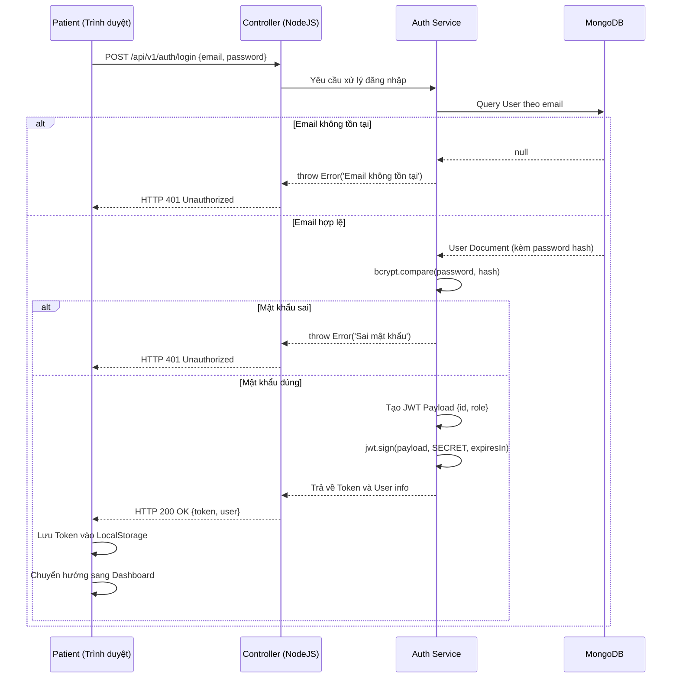
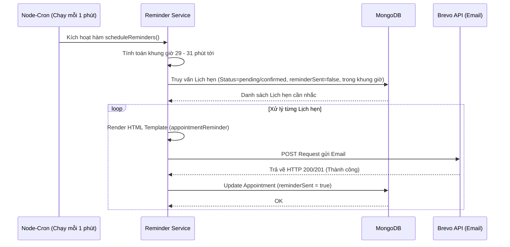
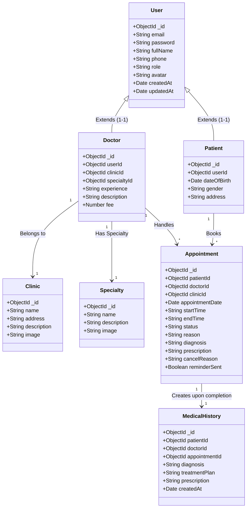
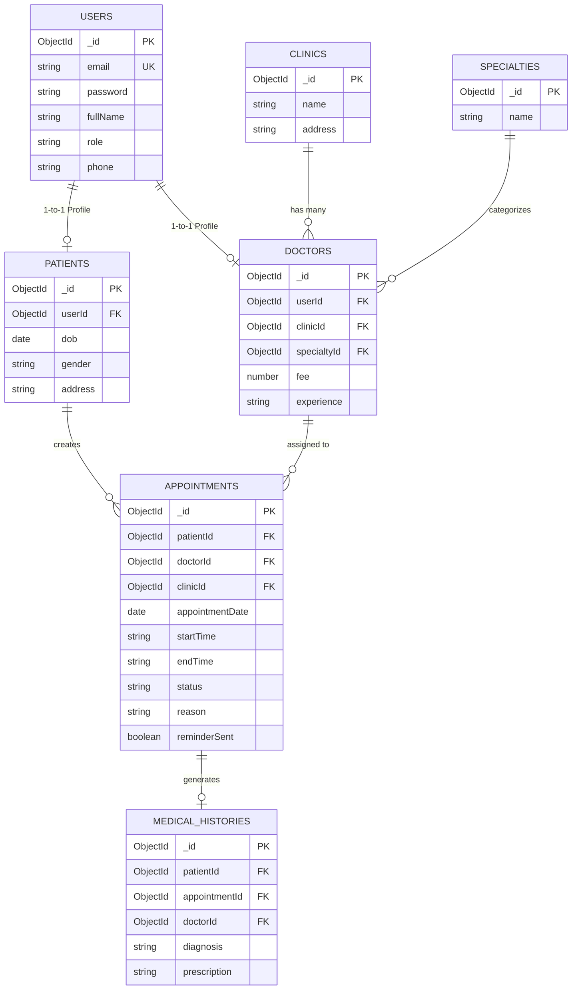

# BÁO CÁO ĐỒ ÁN MÔN HỌC: CÔNG NGHỆ PHẦN MỀM
**TÊN ĐỀ TÀI: XÂY DỰNG HỆ THỐNG ĐẶT LỊCH KHÁM BỆNH TRỰC TUYẾN - MEDIFLOW**
**MÃ MÔN HỌC:** SE101 - **GIẢNG VIÊN HƯỚNG DẪN:** ...

---

## MỤC LỤC
1. [Chương 1. Giới thiệu đề tài](#chương-1-giới-thiệu-đề-tài)
2. [Chương 2. Khảo sát và phân tích yêu cầu](#chương-2-khảo-sát-và-phân-tích-yêu-cầu)
3. [Chương 3. Phân tích hệ thống](#chương-3-phân-tích-hệ-thống)
4. [Chương 4. Thiết kế hệ thống](#chương-4-thiết-kế-hệ-thống)
5. [Chương 5. Cài đặt hệ thống](#chương-5-cài-đặt-hệ-thống)
6. [Chương 6. Kiểm thử](#chương-6-kiểm-thử)
7. [Chương 7. Kết luận và hướng phát triển](#chương-7-kết-luận-và-hướng-phát-triển)
8. [Phụ lục](#phụ-lục)

---

## CHƯƠNG 1. GIỚI THIỆU ĐỀ TÀI

### 1.1 Lý do chọn đề tài
Trong kỷ nguyên công nghệ số 4.0, sự phát triển mạnh mẽ của Internet và các thiết bị di động đã làm thay đổi thói quen sinh hoạt và tiêu dùng của con người. Lĩnh vực y tế cũng không nằm ngoài xu thế đó. Tuy nhiên, tại Việt Nam, quy trình khám chữa bệnh tại nhiều cơ sở y tế (đặc biệt là bệnh viện công tuyến đầu) vẫn còn nhiều bất cập. Bệnh nhân thường xuyên phải đến từ rất sớm để lấy số thứ tự, xếp hàng chờ đợi hàng giờ đồng hồ chỉ để được gặp bác sĩ trong vài phút. Điều này không chỉ gây ra sự mệt mỏi, tốn kém thời gian và chi phí đi lại cho người bệnh mà còn tạo áp lực khổng lồ lên đội ngũ nhân viên y tế và bộ phận lễ tân.

Nhận thấy những vấn đề bức thiết đó, dự án **MediFlow - Hệ thống đặt lịch khám bệnh trực tuyến** được ra đời. Đề tài nhằm mục đích xây dựng một giải pháp phần mềm toàn diện, số hóa quy trình tiếp nhận bệnh nhân. Thông qua hệ thống, bệnh nhân có thể chủ động tìm kiếm thông tin về bác sĩ, phòng khám, các chuyên khoa và tự do lựa chọn khung giờ khám phù hợp với lịch trình cá nhân. 

### 1.2 Mục tiêu đề tài
- **Mục tiêu chung:** Xây dựng thành công một ứng dụng Web hoàn chỉnh, có khả năng hoạt động ổn định trên môi trường Internet thực tế, giải quyết được bài toán đặt lịch khám bệnh.
- **Mục tiêu cụ thể đối với Người bệnh (Patient):** 
  - Tạo tài khoản, lưu trữ hồ sơ y tế cá nhân điện tử.
  - Cho phép tra cứu thông tin chuyên sâu về bác sĩ (kinh nghiệm, giá khám) và phòng khám.
  - Hỗ trợ đặt lịch khám online chính xác đến từng phút, giảm thiểu 100% thời gian lấy số trực tiếp.
  - Nhận nhắc nhở lịch khám tự động qua hệ thống Email chuyên nghiệp để không bỏ lỡ cuộc hẹn.
- **Mục tiêu cụ thể đối với Bác sĩ (Doctor):**
  - Số hóa lịch làm việc (Schedules).
  - Nắm bắt được số lượng và thông tin cơ bản của bệnh nhân trước khi họ đến khám.
  - Có công cụ để nhập liệu chẩn đoán, kê đơn thuốc nhanh chóng, lưu trữ Lịch sử khám lâu dài.
- **Mục tiêu cụ thể đối với Quản trị viên (Admin):**
  - Có trang quản trị (Dashboard) độc lập, trực quan.
  - Quản lý toàn diện dữ liệu Master Data (Danh mục phòng khám, Danh mục chuyên khoa).
  - Quản lý, phân quyền tài khoản người dùng, có khả năng can thiệp vào các lịch hẹn bất thường.

### 1.3 Phạm vi nghiên cứu
- **Về mặt công nghệ:** Đề tài tập trung vào việc áp dụng hệ sinh thái JavaScript (NodeJS, ExpressJS ở Backend và Vanilla JS ở Frontend), sử dụng cơ sở dữ liệu phi cấu trúc MongoDB nhưng được thiết kế với tư duy chuẩn hóa của cơ sở dữ liệu quan hệ (RDBMS).
- **Về mặt quy trình nghiệp vụ:** Giới hạn ở việc đặt lịch khám ngoại trú. Hệ thống tập trung vào luồng: Đăng ký -> Tìm kiếm -> Đặt lịch -> Xác nhận -> Khám bệnh -> Trả kết quả.
- **Các tính năng chưa bao gồm:** Thanh toán trực tuyến (Payment Gateway), Gọi điện khám bệnh từ xa (Telemedicine / WebRTC), Chat trực tuyến (Real-time chat). Những tính năng này được liệt kê vào mục tiêu mở rộng trong tương lai.

### 1.4 Đối tượng sử dụng
Hệ thống được thiết kế dành cho 3 nhóm đối tượng chính, mỗi nhóm được cấp một Role (vai trò) riêng biệt trong hệ thống với các đặc quyền truy cập khác nhau:
1. **Patient (Bệnh nhân):** Người dùng cuối, có nhu cầu sử dụng dịch vụ y tế.
2. **Doctor (Bác sĩ):** Chuyên gia y tế trực tiếp cung cấp dịch vụ khám bệnh.
3. **Admin (Quản trị viên):** Người vận hành, bảo trì và kiểm soát chất lượng dữ liệu trên toàn bộ nền tảng.

### 1.5 Cấu trúc báo cáo
Báo cáo đồ án bao gồm 7 chương:
- **Chương 1:** Giới thiệu tổng quan về lý do, mục tiêu và phạm vi của đề tài.
- **Chương 2:** Khảo sát bài toán thực tế và Phân tích chi tiết các yêu cầu chức năng, phi chức năng.
- **Chương 3:** Phân tích hệ thống thông qua các công cụ mô hình hóa UML (Use Case, Activity, Sequence, Class Diagrams).
- **Chương 4:** Thiết kế chi tiết hệ thống bao gồm Kiến trúc, Cơ sở dữ liệu (ERD), API và Giao diện UI/UX.
- **Chương 5:** Cài đặt hệ thống, trình bày về công nghệ và cấu trúc mã nguồn.
- **Chương 6:** Kiểm thử (Testing) hệ thống bằng các kịch bản Test Case chi tiết và kiểm thử API.
- **Chương 7:** Kết luận, đánh giá ưu nhược điểm và định hướng phát triển.

---

## CHƯƠNG 2. KHẢO SÁT VÀ PHÂN TÍCH YÊU CẦU

### 2.1 Khảo sát quy trình nghiệp vụ thực tế
Quy trình khám bệnh truyền thống hiện nay thường diễn ra theo các bước:
1. Bệnh nhân đến bệnh viện/phòng khám, xếp hàng ở quầy lễ tân để đăng ký khám.
2. Lễ tân nhập thông tin bệnh nhân vào sổ sách hoặc phần mềm cục bộ, sau đó in phiếu số thứ tự.
3. Bệnh nhân cầm phiếu số thứ tự, đến trước cửa phòng khám và chờ gọi tên. Đôi khi thời gian chờ có thể lên đến 2-3 tiếng.
4. Bác sĩ gọi bệnh nhân vào khám, ghi chép vào sổ y bạ giấy.
5. Bệnh nhân mang sổ y bạ đi mua thuốc và ra về.

**Những điểm nghẽn (Pain points):**
- Tốn quá nhiều thời gian chờ đợi vô ích.
- Hồ sơ giấy (sổ y bạ) dễ bị thất lạc, rách nát, khó khăn cho việc tra cứu tiền sử bệnh lý sau này.
- Bác sĩ không thể biết trước tình trạng quá tải để chủ động sắp xếp thời gian.
- Phòng khám thiếu công cụ để nhắc nhở bệnh nhân, dẫn đến tình trạng bệnh nhân quên lịch khám (No-show rate cao).

### 2.2 Đề xuất giải pháp bằng phần mềm MediFlow
- Chuyển đổi toàn bộ quá trình đăng ký lên môi trường Online.
- Bác sĩ chia thời gian làm việc thành các "Slots" (khung giờ) cố định (ví dụ 30 phút/ca). Bệnh nhân chỉ cần đến đúng khung giờ đã đặt, loại bỏ hoàn toàn thời gian chờ đợi.
- Mọi chẩn đoán, toa thuốc được lưu trữ vào CSDL đám mây (Cloud Database) và gắn liền với tài khoản của bệnh nhân trọn đời.

### 2.3 Yêu cầu chức năng (Functional Requirements)

Hệ thống được chia thành 3 phân hệ (Modules) chính. Dưới đây là danh sách yêu cầu chi tiết (User Requirements Document):

#### 2.3.1. Phân hệ Bệnh nhân (Patient Module)
1. **Đăng ký tài khoản (Register):** Cho phép người dùng đăng ký bằng Email, Mật khẩu và Họ tên.
2. **Đăng nhập / Đăng xuất (Auth):** Xác thực tài khoản. Hệ thống tự động điều hướng về màn hình dành riêng cho bệnh nhân sau khi đăng nhập thành công.
3. **Cập nhật hồ sơ (Profile Management):** Người bệnh có thể cập nhật thông tin cá nhân: Giới tính, Ngày sinh, Số điện thoại, Địa chỉ cư trú.
4. **Tìm kiếm (Search & Filter):** 
   - Tìm kiếm bác sĩ theo Tên, Chuyên khoa.
   - Tìm kiếm phòng khám theo Tên, Khu vực.
5. **Xem chi tiết Bác sĩ/Phòng khám:** Xem giới thiệu, kinh nghiệm công tác, giá khám và lịch làm việc của bác sĩ.
6. **Đặt lịch khám (Book Appointment):** 
   - Lựa chọn Ngày khám.
   - Lựa chọn Khung giờ khám còn trống (Hệ thống tự động filter các giờ đã bị người khác đặt).
   - Nhập triệu chứng/lý do khám.
7. **Quản lý lịch hẹn:**
   - Xem danh sách lịch hẹn sắp tới.
   - Hủy lịch hẹn (Chỉ cho phép hủy khi lịch đang ở trạng thái Pending hoặc Confirmed, không cho phép hủy khi đã Completed).
8. **Xem lịch sử khám bệnh (Medical History):** Xem lại chi tiết chẩn đoán, toa thuốc của các lần khám trước đây.
9. **Nhận thông báo (Notifications):** Nhận Email xác nhận đặt lịch thành công, Email trả kết quả và Email nhắc nhở tự động 30 phút trước giờ khám.

#### 2.3.2. Phân hệ Bác sĩ (Doctor Module)
1. **Đăng nhập hệ thống:** Bác sĩ sử dụng tài khoản do Admin cung cấp để truy cập.
2. **Bảng điều khiển (Dashboard):** Xem tổng quan số lượng lịch khám trong ngày (Tổng số, Chờ duyệt, Đã hoàn thành).
3. **Quản lý lịch hẹn:**
   - Xem danh sách bệnh nhân theo ngày.
   - Xác nhận lịch hẹn (Đổi trạng thái `pending` -> `confirmed`).
   - Hủy lịch hẹn trong trường hợp bất khả kháng và ghi rõ lý do.
4. **Ghi nhận kết quả khám:** 
   - Form nhập liệu Chẩn đoán lâm sàng (Diagnosis).
   - Form kê đơn thuốc (Prescription).
   - Hoàn tất ca khám (Đổi trạng thái `confirmed` -> `completed`).

#### 2.3.3. Phân hệ Quản trị viên (Admin Module)
1. **Đăng nhập hệ thống:** Quyền truy cập tối cao (Super User).
2. **Quản lý Người dùng (Users):** Xem danh sách toàn bộ Users, khóa (Ban) hoặc mở khóa tài khoản.
3. **Quản lý Bác sĩ (Doctors):** Thêm mới tài khoản bác sĩ, thiết lập giá khám, gán bác sĩ vào các Chuyên khoa và Phòng khám cụ thể.
4. **Quản lý Phòng khám (Clinics):** Thêm, sửa, xóa thông tin phòng khám, cập nhật địa chỉ, hình ảnh.
5. **Quản lý Chuyên khoa (Specialties):** Thêm, sửa, xóa danh mục chuyên khoa.
6. **Quản lý toàn bộ Lịch hẹn (Appointments):** Có cái nhìn tổng quan về tất cả các lịch hẹn đang diễn ra trên hệ thống. Admin có quyền hủy lịch hoặc thay đổi trạng thái trong trường hợp xảy ra sự cố kỹ thuật.
7. **Báo cáo thống kê:** Thống kê tổng số lượng bệnh nhân, bác sĩ, lịch hẹn trên Dashboard.

### 2.4 Yêu cầu phi chức năng (Non-functional Requirements)
Để đảm bảo hệ thống vận hành trơn tru và đạt tiêu chuẩn công nghiệp phần mềm, các yêu cầu phi chức năng sau phải được đáp ứng:

1. **Yêu cầu về Bảo mật (Security):**
   - Không lưu trữ mật khẩu dưới dạng văn bản thô (Plain-text). Bắt buộc phải sử dụng hàm băm (Hashing) với Salt bằng thư viện `bcrypt`.
   - Các API phải được bảo vệ bởi cơ chế xác thực Stateless thông qua JSON Web Token (JWT).
   - Phân quyền (Authorization) chặt chẽ: Bệnh nhân không thể gọi API của Bác sĩ, và Bác sĩ không thể gọi API của Admin. Lỗi trả về phải là `403 Forbidden`.
   - Ngăn chặn tấn công XSS, SQL/NoSQL Injection, sử dụng HelmetJS để bảo vệ HTTP Headers.
2. **Yêu cầu về Hiệu năng (Performance):**
   - Thời gian phản hồi trung bình (Response time) của các REST API không vượt quá 1000ms đối với đường truyền mạng tiêu chuẩn.
   - Hàm kiểm tra trùng lịch (Conflict check) khi đặt lịch phải xử lý nhanh chóng để khóa slot, tránh tình trạng Race Condition (Nhiều người cùng đặt 1 slot cùng lúc).
3. **Yêu cầu về Tính khả dụng (Availability & Reliability):**
   - Ứng dụng phải hoạt động 24/7. 
   - Tác vụ gửi Email phải được thiết kế dạng non-blocking (hoạt động ngầm) để không làm treo tiến trình chính của Server khi API của nhà cung cấp Email (Brevo) phản hồi chậm.
   - Cronjob nhắc lịch phải chạy độc lập và xử lý lỗi (try-catch) kỹ lưỡng để không làm crash toàn bộ Server.
4. **Yêu cầu về Giao diện (Usability):**
   - Thiết kế chuẩn Responsive, giao diện không bị vỡ bố cục (layout) khi hiển thị trên các thiết bị di động (Mobile, Tablet) hay PC màn hình lớn.
   - Tuân thủ quy tắc phối màu chuẩn, dễ đọc, mang lại cảm giác tin cậy cho một nền tảng y tế (Sử dụng tone màu Xanh dương làm chủ đạo).
5. **Yêu cầu về Khả năng bảo trì và Mở rộng (Maintainability & Scalability):**
   - Mã nguồn phải được cấu trúc theo mô hình MVC, tách biệt rõ ràng giữa Routing, Controller, Service và Repository.
   - Mọi thông tin nhạy cảm (API Keys, Database URI, JWT Secret) bắt buộc phải lưu trong biến môi trường `.env`, không được hard-code vào mã nguồn.

---

## CHƯƠNG 3. PHÂN TÍCH HỆ THỐNG (UML)

Trong quy trình công nghệ phần mềm, Phân tích hướng đối tượng (OOA) sử dụng Ngôn ngữ mô hình hóa thống nhất (UML) đóng vai trò sống còn giúp làm rõ luồng nghiệp vụ trước khi bắt tay vào code.

### 3.1 Biểu đồ Use Case (Use Case Diagram)

Biểu đồ Use Case dưới đây mô tả tổng quan sự tương tác giữa các tác nhân (Actors) và hệ thống MediFlow.

```mermaid
usecaseDiagram
    actor "Patient\n(Bệnh nhân)" as P
    actor "Doctor\n(Bác sĩ)" as D
    actor "Admin\n(Quản trị viên)" as A

    rectangle "MediFlow System - Đặt lịch khám trực tuyến" {
        usecase "UC01: Đăng ký tài khoản" as UC1
        usecase "UC02: Đăng nhập hệ thống" as UC2
        usecase "UC03: Quản lý hồ sơ cá nhân" as UC3
        usecase "UC04: Tìm kiếm bác sĩ/phòng khám" as UC4
        usecase "UC05: Đặt lịch khám" as UC5
        usecase "UC06: Xem danh sách & Hủy lịch" as UC6
        usecase "UC07: Xem lịch sử khám bệnh" as UC7
        usecase "UC08: Xem danh sách lịch hẹn" as UC8
        usecase "UC09: Xác nhận duyệt lịch" as UC9
        usecase "UC10: Ghi nhận kết quả khám" as UC10
        usecase "UC11: Quản lý Users" as UC11
        usecase "UC12: Quản lý Doctors" as UC12
        usecase "UC13: Quản lý Clinics" as UC13
        usecase "UC14: Quản lý Specialties" as UC14
        usecase "UC15: Quản lý toàn bộ Appointments" as UC15
    }

    P --> UC1
    P --> UC2
    P --> UC3
    P --> UC4
    P --> UC5
    P --> UC6
    P --> UC7

    D --> UC2
    D --> UC8
    D --> UC9
    D --> UC10

    A --> UC2
    A --> UC11
    A --> UC12
    A --> UC13
    A --> UC14
    A --> UC15
```

### 3.2 Đặc tả Use Case chi tiết (Use Case Specifications)

Để đội ngũ phát triển (Developers) lập trình chính xác, các Use Case trọng tâm cần được đặc tả chi tiết.

#### Đặc tả UC05 - Đặt lịch khám (Book Appointment)
- **Tên Use Case:** Đặt lịch khám bệnh.
- **Mục đích:** Cho phép bệnh nhân chọn bác sĩ, chọn giờ và xác nhận đặt một cuộc hẹn.
- **Tác nhân (Actor):** Bệnh nhân (Patient).
- **Điều kiện tiên quyết:** Bệnh nhân đã đăng nhập vào hệ thống và đã cập nhật số điện thoại trong hồ sơ cá nhân. Bác sĩ được chọn đang có lịch làm việc.
- **Luồng sự kiện chính (Main Flow):**
  1. Bệnh nhân truy cập trang chi tiết Bác sĩ.
  2. Bệnh nhân sử dụng Input Date (Lịch) để chọn ngày muốn khám.
  3. Hệ thống gửi request API về Server để kiểm tra lịch trống của bác sĩ đó trong ngày đã chọn.
  4. Hệ thống (Frontend) render danh sách các khung giờ trống (Slots) dưới dạng các nút bấm.
  5. Bệnh nhân click chọn 1 khung giờ phù hợp.
  6. Bệnh nhân nhập thông tin "Triệu chứng / Lý do khám" vào form.
  7. Bệnh nhân click nút "Xác nhận đặt lịch".
  8. Hệ thống (Backend) tiến hành validation: Kiểm tra ngày giờ có ở trong quá khứ không? Khung giờ có bị ai khác đặt trùng trong tích tắc không?
  9. Hệ thống lưu cuộc hẹn vào CSDL với trạng thái `pending`.
  10. Hệ thống gọi Brevo API gửi một Email xác nhận đến hòm thư của bệnh nhân.
  11. Trả về thông báo thành công trên giao diện và điều hướng bệnh nhân sang trang Quản lý lịch hẹn.
- **Luồng ngoại lệ (Alternative Flow):**
  - Tại bước 8, nếu phát hiện có người khác vừa đặt slot đó, hệ thống trả về lỗi `409 Conflict: Khung giờ này đã có người đặt`. Giao diện hiển thị thông báo lỗi màu đỏ và yêu cầu bệnh nhân refresh lại trang để chọn khung giờ khác.
- **Điều kiện sau (Post-condition):** Cuộc hẹn được tạo thành công, có thể tra cứu được trên Dashboard của cả Bác sĩ và Bệnh nhân.

#### Đặc tả UC10 - Ghi nhận kết quả khám (Complete Appointment)
- **Tên Use Case:** Ghi nhận kết quả khám và trả toa thuốc.
- **Mục đích:** Hỗ trợ bác sĩ số hóa quy trình khám, tạo ra bệnh án điện tử (Medical History).
- **Tác nhân (Actor):** Bác sĩ (Doctor).
- **Điều kiện tiên quyết:** Bác sĩ đã đăng nhập. Cuộc hẹn phải đang ở trạng thái đã duyệt (`confirmed`). Không thể hoàn thành cuộc hẹn đang `pending` hoặc `cancelled`.
- **Luồng sự kiện chính (Main Flow):**
  1. Sau khi khám thực tế xong, Bác sĩ mở Dashboard, tìm đến cuộc hẹn tương ứng.
  2. Bác sĩ click nút "Khám xong / Cập nhật".
  3. Hệ thống hiển thị Modal Form yêu cầu nhập: Chẩn đoán (Bắt buộc), Đơn thuốc (Tùy chọn), Lời dặn (Tùy chọn).
  4. Bác sĩ điền đầy đủ dữ liệu và bấm "Lưu kết quả".
  5. Hệ thống gọi API PUT để cập nhật trạng thái cuộc hẹn thành `completed`.
  6. Trình kích hoạt (Trigger logic) ở Backend tự động tạo một Document mới trong bảng `MedicalHistories` chứa toàn bộ dữ liệu khám và ánh xạ với ID của Bệnh nhân.
  7. Hệ thống tự động gửi Email tổng hợp (gồm chẩn đoán và đơn thuốc) cho bệnh nhân.
  8. Hệ thống thông báo thành công, UI tự động loại bỏ cuộc hẹn đó khỏi danh sách "Chờ khám".
- **Điều kiện sau (Post-condition):** Trạng thái lịch là `completed`. Bệnh nhân có thể xem lại kết quả khám trong tab Lịch sử.

### 3.3 Biểu đồ Hoạt động (Activity Diagram)

Biểu đồ hoạt động giúp mô phỏng luồng chảy nghiệp vụ (Business logic flow) của hệ thống.

**Activity Diagram: Luồng Đặt lịch khám và Xử lý trùng lặp (Concurrency Handling)**

```mermaid
flowchart TD
    Start((Bắt đầu)) --> Login[Bệnh nhân Đăng nhập]
    Login --> Search[Tìm Bác sĩ / Phòng khám]
    Search --> PickDoc[Chọn Bác sĩ cụ thể]
    PickDoc --> PickDate[Chọn Ngày khám (Input Date)]
    
    PickDate --> QueryAPI{API: Lấy Slot trống}
    QueryAPI -->|Trả về Array| RenderSlots[Hiển thị danh sách giờ (8:00, 8:30...)]
    
    RenderSlots --> UserAction[Bệnh nhân chọn 1 Slot]
    UserAction --> FillForm[Nhập Triệu chứng]
    FillForm --> Submit[Bấm nút 'Xác nhận Đặt lịch']
    
    Submit --> CheckConflict{Backend:\nKiểm tra trùng lịch?}
    
    CheckConflict -- Bị trùng (Có người đặt trước) --> ThrowError[Trả về lỗi 409 Conflict]
    ThrowError --> Alert[Hiển thị Toast: 'Giờ đã được đặt, vui lòng chọn lại']
    Alert --> PickDate
    
    CheckConflict -- Hợp lệ (Không trùng) --> SaveDB[Lưu vào Database, Status='pending']
    SaveDB --> SendMail[Kích hoạt Background Job: Gửi Email Xác nhận]
    SendMail --> SuccessResponse[Trả về 201 Created]
    SuccessResponse --> Redirect[Chuyển hướng sang trang Quản lý lịch hẹn]
    Redirect --> End((Kết thúc))
```

### 3.4 Biểu đồ Tuần tự (Sequence Diagram)

Biểu đồ tuần tự mô tả chi tiết sự giao tiếp giữa các thành phần (Client, Server, Database, Third-party Services) theo thứ tự thời gian thực tế.

**Sequence Diagram: Tác vụ Đăng nhập (Authentication) bằng JWT**



**Sequence Diagram: Background Job Cronjob nhắc lịch khám**

Cronjob là một tính năng đặc biệt của hệ thống, tự động chạy ngầm mà không cần ai tác động.



### 3.5 Biểu đồ Lớp (Class Diagram)

Biểu đồ lớp định hình cấu trúc dữ liệu, là tiền đề để thiết kế Database.



---

## CHƯƠNG 4. THIẾT KẾ HỆ THỐNG

### 4.1 Kiến trúc hệ thống tổng thể

Hệ thống được thiết kế theo **Kiến trúc Client-Server** và áp dụng mẫu thiết kế đa tầng (Multi-tier Architecture) để chia nhỏ độ phức tạp:

- **Client (Frontend):** 
  - Giao diện người dùng được xây dựng bằng HTML, CSS (Bootstrap) và JavaScript. 
  - Đảm nhận việc giao tiếp với Server qua REST API bằng hàm `fetch()`.
  - Quản lý trạng thái đăng nhập qua `localStorage`.
- **Server (Backend):**
  - **NodeJS/ExpressJS:** Cung cấp môi trường thực thi và xử lý routing HTTP.
  - Áp dụng **MVC (Model-View-Controller)** kết hợp **Repository Pattern**:
    - `Routes`: Định tuyến các endpoint HTTP tới Controller tương ứng.
    - `Controllers`: Nhận Request, trích xuất dữ liệu, kiểm tra tính hợp lệ cơ bản và gửi dữ liệu xuống Service.
    - `Services`: Nơi xử lý Business Logic (Ví dụ: kiểm tra trùng lịch, mã hóa mật khẩu).
    - `Repositories`: Chuyên trách giao tiếp với Database (Find, Create, Update, Delete) nhằm tách biệt logic CSDL ra khỏi nghiệp vụ.
    - `Models`: Cấu trúc Schema do Mongoose quản lý.
- **Database:**
  - MongoDB - Hệ quản trị cơ sở dữ liệu NoSQL, nhưng được thiết kế quan hệ chặt chẽ.

### 4.2 Thiết kế Cơ sở dữ liệu (Database Schema / SQL Server mapping)

*(Ghi chú: Đề tài xây dựng trên MongoDB, tuy nhiên để đáp ứng yêu cầu phân tích thiết kế CSDL truyền thống (Relational Database Design), các Collections của MongoDB được chuẩn hóa dưới dạng các Bảng (Tables) có PK, FK nghiêm ngặt).*

**Biểu đồ Thực thể - Liên kết (Entity Relationship Diagram - ERD)**


#### Chi tiết cấu trúc Bảng Đề xuất (Table Definitions)

**Bảng 1: USERS (Người dùng hệ thống)**
Lưu trữ thông tin xác thực cốt lõi của mọi đối tượng.
| Tên thuộc tính | Kiểu dữ liệu | Khóa | Ràng buộc | Mô tả chi tiết |
|---|---|---|---|---|
| _id | VARCHAR(255) | PK | AUTO / ObjectId | Khóa chính tự sinh |
| email | VARCHAR(150) | UK | NOT NULL | Dùng để đăng nhập, Unique |
| password | VARCHAR(255) | | NOT NULL | Chuỗi băm (Bcrypt hash) |
| fullName | VARCHAR(100) | | NOT NULL | Tên hiển thị trên giao diện |
| phone | VARCHAR(15) | | NULLABLE | Số điện thoại liên lạc |
| role | VARCHAR(20) | | IN ('admin', 'doctor', 'patient') | Quyền hạn trong hệ thống |
| createdAt | DATETIME | | DEFAULT GETDATE()| Ngày tạo tài khoản |

**Bảng 2: PATIENTS (Hồ sơ bệnh nhân)**
Mở rộng thông tin y tế cơ bản của User có role là patient.
| Tên thuộc tính | Kiểu dữ liệu | Khóa | Ràng buộc | Mô tả chi tiết |
|---|---|---|---|---|
| _id | VARCHAR(255) | PK | AUTO / ObjectId | Khóa chính |
| userId | VARCHAR(255) | FK | REFERENCES Users(_id) | Trỏ đến tài khoản gốc |
| dob | DATE | | NULLABLE | Ngày tháng năm sinh |
| gender | VARCHAR(10) | | IN ('Nam', 'Nữ', 'Khác') | Giới tính |
| address | NVARCHAR(500) | | NULLABLE | Địa chỉ sinh sống |

**Bảng 3: DOCTORS (Hồ sơ bác sĩ)**
Mở rộng thông tin chuyên môn của User có role là doctor.
| Tên thuộc tính | Kiểu dữ liệu | Khóa | Ràng buộc | Mô tả chi tiết |
|---|---|---|---|---|
| _id | VARCHAR(255) | PK | AUTO / ObjectId | Khóa chính |
| userId | VARCHAR(255) | FK | REFERENCES Users(_id) | Trỏ đến tài khoản gốc |
| clinicId | VARCHAR(255) | FK | REFERENCES Clinics(_id) | Phòng khám công tác |
| specialtyId| VARCHAR(255) | FK | REFERENCES Specialties(_id)| Chuyên khoa chính |
| experience | NVARCHAR(2000)| | NULLABLE | Tiểu sử kinh nghiệm làm việc |
| fee | INT | | DEFAULT 0 | Phí khám bệnh (VND) |

**Bảng 4: CLINICS (Phòng khám)**
| Tên thuộc tính | Kiểu dữ liệu | Khóa | Ràng buộc | Mô tả chi tiết |
|---|---|---|---|---|
| _id | VARCHAR(255) | PK | AUTO / ObjectId | Khóa chính |
| name | NVARCHAR(255) | | NOT NULL | Tên phòng khám / Bệnh viện |
| address | NVARCHAR(500) | | NOT NULL | Địa chỉ bản đồ |
| description| NVARCHAR(MAX) | | NULLABLE | Giới thiệu phòng khám |
| image | VARCHAR(500) | | NULLABLE | URL ảnh banner |

**Bảng 5: SPECIALTIES (Chuyên khoa)**
| Tên thuộc tính | Kiểu dữ liệu | Khóa | Ràng buộc | Mô tả chi tiết |
|---|---|---|---|---|
| _id | VARCHAR(255) | PK | AUTO / ObjectId | Khóa chính |
| name | NVARCHAR(100) | UK | NOT NULL | Tên (VD: Nhi khoa, Tim mạch) |

**Bảng 6: APPOINTMENTS (Lịch hẹn khám)**
Lưu trữ giao dịch đặt lịch. Đây là bảng quan trọng nhất hệ thống (Core Table).
| Tên thuộc tính | Kiểu dữ liệu | Khóa | Ràng buộc | Mô tả chi tiết |
|---|---|---|---|---|
| _id | VARCHAR(255) | PK | AUTO / ObjectId | Khóa chính |
| patientId | VARCHAR(255) | FK | REFERENCES Users(_id) | Bệnh nhân nào đặt |
| doctorId | VARCHAR(255) | FK | REFERENCES Users(_id) | Bác sĩ nào khám |
| clinicId | VARCHAR(255) | FK | REFERENCES Clinics(_id)| Thuộc phòng khám nào |
| appointmentDate| DATE | | NOT NULL | Ngày khám thực tế |
| startTime | VARCHAR(5) | | NOT NULL | Định dạng HH:MM (VD: 08:30) |
| endTime | VARCHAR(5) | | NOT NULL | Định dạng HH:MM (VD: 09:00) |
| status | VARCHAR(20) | | DEFAULT 'pending' | pending/confirmed/completed/cancelled|
| reason | NVARCHAR(1000)| | NULLABLE | Lý do / Triệu chứng bệnh nhân điền |
| cancelReason| NVARCHAR(1000)| | NULLABLE | Lý do hủy lịch nếu status=cancelled |
| reminderSent| BIT | | DEFAULT 0 (false) | Cờ đánh dấu đã gửi mail nhắc lịch |

**Bảng 7: MEDICAL_HISTORIES (Lịch sử bệnh án)**
Lưu trữ kết quả sau khi khám hoàn thành.
| Tên thuộc tính | Kiểu dữ liệu | Khóa | Ràng buộc | Mô tả chi tiết |
|---|---|---|---|---|
| _id | VARCHAR(255) | PK | AUTO / ObjectId | Khóa chính |
| patientId | VARCHAR(255) | FK | REFERENCES Users(_id) | Bệnh nhân sở hữu |
| appointmentId| VARCHAR(255) | FK | REFERENCES Appointments(_id)| Bắt nguồn từ lịch hẹn nào |
| doctorId | VARCHAR(255) | FK | REFERENCES Users(_id) | Bác sĩ trực tiếp khám |
| diagnosis | NVARCHAR(MAX) | | NOT NULL | Chẩn đoán lâm sàng bệnh lý |
| prescription| NVARCHAR(MAX) | | NULLABLE | Toa thuốc chi tiết |
| createdAt | DATETIME | | DEFAULT GETDATE() | Thời điểm ghi nhận kết quả |

### 4.4 Thiết kế API (Application Programming Interface)

Hệ thống được thiết kế theo tiêu chuẩn RESTful API. Mọi Response đều có định dạng chuẩn JSON để Client dễ parse:
```json
{
  "success": true,
  "message": "Thông báo trạng thái",
  "data": { ... } // Hoặc null nếu thất bại
}
```

**Danh sách các API quan trọng:**

**1. Auth APIs (Public)**
| API Route | Method | Mục đích | Request Body | Phản hồi (Response) |
|---|---|---|---|---|
| `/api/v1/auth/login` | POST | Đăng nhập | `{email, password}` | Token JWT, Role |
| `/api/v1/auth/register`| POST | Đăng ký Bệnh nhân | `{email, password, fullName}` | `201 Created` |

**2. Doctor APIs (Public)**
| API Route | Method | Mục đích | Request Query | Phản hồi (Response) |
|---|---|---|---|---|
| `/api/v1/doctors` | GET | Lấy danh sách bác sĩ | `page, limit, specialty` | Mảng thông tin bác sĩ |
| `/api/v1/doctors/:id`| GET | Chi tiết 1 bác sĩ | N/A | Object thông tin bác sĩ |

**3. Appointment APIs (Protected - Cần Token JWT)**
| API Route | Method | Mục đích | Role Yêu cầu | Request Body/Query |
|---|---|---|---|---|
| `/api/v1/appointments/available-slots` | GET | Lấy các giờ trống | Public | `?doctorId=...&date=YYYY-MM-DD` |
| `/api/v1/appointments` | POST | Đặt lịch khám mới | Patient | `{doctorId, date, startTime, endTime, symptoms}` |
| `/api/v1/appointments` | GET | Xem danh sách lịch | Patient / Doctor | N/A |
| `/api/v1/appointments/:id/status`| PUT | Cập nhật trạng thái | Doctor / Admin | `{status, diagnosis, prescription, cancelReason}` |

**4. Medical History APIs (Protected)**
| API Route | Method | Mục đích | Role Yêu cầu | Request Body/Query |
|---|---|---|---|---|
| `/api/v1/medical-history/me` | GET | Bệnh nhân lấy bệnh án | Patient | N/A |

### 4.5 Thiết kế Giao diện (UI/UX Design)

Hệ thống cung cấp trải nghiệm thân thiện, màu xanh dương đặc trưng của ngành y tế (#2563EB).

1. **Trang chủ & Tìm kiếm (Homepage):** Thanh điều hướng Navbar trên cùng. Ở giữa màn hình là thanh tìm kiếm lớn theo từ khóa. Bên dưới hiển thị dạng lưới (Grid 4 cột) các chuyên khoa nổi bật (Tim mạch, Tai mũi họng, Tiêu hóa) kèm icon trực quan.
2. **Chi tiết Bác sĩ & Đặt lịch (Doctor Detail):** Phía trên là thông tin Bác sĩ (Avatar, kinh nghiệm, phòng khám). Bên dưới là tiện ích chọn Ngày (Date Picker). Khi click một ngày, các khung giờ hiện ra dạng Label (Tag). Khung giờ đã bị đặt sẽ bị khóa (Disabled) và mờ đi. Người dùng chọn 1 khung giờ -> Hiển thị Modal nhập lý do -> Submit.
3. **Dashboard Bệnh nhân (Patient Portal):** Layout Sidebar trái chứa menu (Thông tin cá nhân, Lịch sử đặt lịch, Hồ sơ bệnh án). Phần Content hiển thị bảng dữ liệu. Nút "Hủy lịch" có màu Đỏ, có hiệu lực khi lịch là Pending.
4. **Dashboard Bác sĩ (Doctor Portal):** Thiết kế tối ưu cho công việc hàng ngày. Table danh sách bệnh nhân chờ khám hôm nay. Có 3 nút Action cực kỳ rõ ràng:
   - Nút "Duyệt" (Màu xanh lá) -> Chuyển lịch thành Confirmed.
   - Nút "Hoàn thành" (Màu xanh dương) -> Bật Modal nhập "Chẩn đoán bệnh" và "Đơn thuốc".
5. **Dashboard Admin (Admin Panel):** Bảng điều khiển tổng hợp hiển thị số liệu thống kê (Thẻ tổng số Bác sĩ, Bệnh nhân, Cuộc hẹn). Các tab quản lý CRUD (Create-Read-Update-Delete) để thêm sửa xóa dữ liệu Master.

---

## CHƯƠNG 5. CÀI ĐẶT HỆ THỐNG

### 5.1 Kiến trúc Thư mục (Source Code Structure)
Dự án được sắp xếp theo Domain-driven và Phân tầng MVC cực kỳ nghiêm ngặt giúp dự án có thể mở rộng (Scale) dễ dàng.

```text
mediflow-backend/
├── public/                 # Thư mục Frontend (HTML, CSS, JS tĩnh)
│   ├── admin/              # Giao diện cho Admin
│   ├── doctor/             # Giao diện cho Bác sĩ
│   ├── patient/            # Giao diện cho Bệnh nhân
│   └── index.html          # Trang chủ
├── src/                    # Thư mục chứa Logic Backend NodeJS
│   ├── config/             # Cấu hình Database, biến môi trường hệ thống
│   ├── controllers/        # Điều hướng Request -> Lấy dữ liệu -> Trả về HTTP JSON
│   ├── helpers/            # Tiện ích bổ trợ (VD: emailHelper.js quản lý Brevo)
│   ├── jobs/               # Background Jobs (cronjob: reminderJob.js)
│   ├── middlewares/        # Middlewares (Auth JWT kiểm tra Token, Rate Limit chống Spam API)
│   ├── models/             # Schema định nghĩa cấu trúc DB Mongoose
│   ├── repositories/       # Tầng giao tiếp Database (Thực thi các lệnh Find, Save, Update)
│   ├── routes/             # Cấu hình các đường dẫn URL API (Endpoints)
│   └── services/           # Tầng Business Logic (Kiểm tra điều kiện, nghiệp vụ lõi)
├── .env                    # Biến môi trường bảo mật (Không push lên Git)
├── package.json            # File quản lý thư viện npm
└── server.js               # Điểm khởi chạy (Entry point) của Server
```

### 5.2 Giải thích các Module cốt lõi
1. **Repository Pattern:** Để tránh việc viết lặp lại các lệnh gọi CSDL (`Model.find()`) khắp mọi nơi và gây khó khăn khi đổi loại Database, dự án sinh ra thư mục `repositories`. Ví dụ `appointmentRepository.js` chứa hàm `checkConflict(doctorId, date, start, end)`. Tầng Service chỉ cần gọi hàm này, không cần quan tâm nó chạy lệnh MongoDB hay SQL.
2. **Background Jobs (node-cron):** Module `reminderJob.js` được khởi tạo ngay khi Server chạy. Lệnh `cron.schedule('* * * * *')` đảm bảo mỗi phút hệ thống sẽ quét CSDL một lần. Nó sẽ tìm các lịch hẹn có `startTime` nằm trong khoảng chính xác từ 29 đến 31 phút ở thì tương lai. Nếu khớp, nó lấy email bệnh nhân và truyền vào Brevo API. Quá trình này chạy bất đồng bộ ngầm (Asynchronous) hoàn toàn không làm giật lag các API chính.
3. **Transaction Email (Brevo API):** Thay vì dùng Nodemailer + Gmail thường bị Google khóa vì bảo mật (Less secure app) hoặc rơi vào thư mục Spam. MediFlow dùng REST API của nền tảng Brevo. Gửi theo format chuẩn JSON kèm HTML Template chuyên nghiệp.

---

## CHƯƠNG 6. KIỂM THỬ (TESTING)

Kiểm thử là bước sống còn đảm bảo phần mềm không sinh ra lỗi nghiêm trọng (Critical Bugs) trên môi trường Production.

### 6.1 Bảng Kiểm thử kịch bản (Test Cases)

**Module 1: Đăng nhập & Xác thực (Authentication)**
| STT | Tên Test Case | Input (Đầu vào) | Kết quả mong đợi | Kết quả thực tế | Pass/Fail |
|---|---|---|---|---|---|
| 1 | Đăng nhập thành công | Email, Pass đúng | Trả về JWT Token, vào Dashboard tương ứng Role | Đúng như kỳ vọng | ✅ Pass |
| 2 | Sai mật khẩu | Pass sai | Thông báo "Sai tài khoản hoặc mật khẩu", không cấp token| Báo lỗi HTTP 401 | ✅ Pass |
| 3 | Trống thông tin | Submit không nhập gì | Báo lỗi "Vui lòng nhập email" | Hiển thị lỗi form | ✅ Pass |
| 4 | Kiểm tra bảo mật Route| Bệnh nhân cố vào link Admin| Hệ thống chặn, báo 403 Forbidden | Redirect về trang Login| ✅ Pass |

**Module 2: Đặt lịch khám (Core Business Flow)**
| STT | Tên Test Case | Input (Đầu vào) | Kết quả mong đợi | Kết quả thực tế | Pass/Fail |
|---|---|---|---|---|---|
| 5 | Lấy Slot hợp lệ | Chọn ngày mai | Trả về list giờ: 08:00, 08:30.. | List giờ đầy đủ | ✅ Pass |
| 6 | Đặt lịch thành công | Chọn Slot trống, Nhập bệnh| Lưu DB, Status='pending', Nhận email xác nhận | Status = pending, có email| ✅ Pass |
| 7 | **Race Condition Test**| 2 Bệnh nhân ấn đặt cùng 1 Slot tại cùng 1 giây | Người đầu thành công (201). Người 2 bị lỗi 409 Conflict | Người 2 báo lỗi trùng lịch| ✅ Pass |
| 8 | Chặn quá khứ | Chọn ngày hôm qua | Không cho chọn hoặc không hiện Slot | Datepicker bị disabled | ✅ Pass |

**Module 3: Quy trình Bác sĩ (Doctor Flow)**
| STT | Tên Test Case | Input (Đầu vào) | Kết quả mong đợi | Kết quả thực tế | Pass/Fail |
|---|---|---|---|---|---|
| 9 | Bác sĩ duyệt lịch | Bấm "Xác nhận" | Status đổi thành `confirmed`. | Đổi status OK | ✅ Pass |
| 10 | Bác sĩ khám xong | Điền Chẩn đoán, Bấm Xong | Status thành `completed`. Tự động tạo bản ghi trong `MedicalHistories` | Tạo history thành công | ✅ Pass |
| 11 | Check liên kết History| Bệnh nhân vào "Lịch sử khám"| Thấy hiển thị chẩn đoán bác sĩ vừa nhập | Data hiện thị đúng | ✅ Pass |
| 12 | Test Undefined ID bug| Bấm "Xem chi tiết" | Hiển thị Popup bình thường (Bug đã được fix quote string)| Modal mở bình thường | ✅ Pass |

**Module 4: Kiểm thử Tự động hóa (Cronjob)**
| STT | Tên Test Case | Input (Đầu vào) | Kết quả mong đợi | Kết quả thực tế | Pass/Fail |
|---|---|---|---|---|---|
| 13 | Bắn Email nhắc nhở | Fake data lịch hẹn sắp tới 30 phút | Console log "Đã gửi nhắc lịch". Check Inbox email nhận được | Nhận email template Remind | ✅ Pass |
| 14 | Chống gửi trùng lặp | Lịch hẹn đã gửi nhắc nhở | Cronjob tự bỏ qua do có cờ `reminderSent = true` | Không bắn email lần 2 | ✅ Pass |

### 6.2 Kiểm thử API bằng Postman
- Tiến hành tạo một Collection Postman chứa tất cả API.
- Đính kèm Token JWT vào phần `Authorization: Bearer <token>`.
- Thực thi API `POST /api/v1/appointments` với Payload:
  ```json
  {
    "doctorId": "66804a1f2f87a",
    "appointmentDate": "2026-06-30",
    "startTime": "09:00",
    "endTime": "09:30",
    "symptoms": "Đau bụng buồn nôn"
  }
  ```
- Kết quả trả về (201 Created):
  ```json
  {
    "success": true,
    "message": "Đặt lịch hẹn thành công!",
    "data": { "_id": "...", "status": "pending" }
  }
  ```

---

## CHƯƠNG 7. KẾT LUẬN VÀ HƯỚNG PHÁT TRIỂN

### 7.1 Kết luận về Đề tài
Dự án **MediFlow** đã hoàn thành xuất sắc các mục tiêu đề ra ban đầu, áp dụng thành công các quy trình công nghệ phần mềm từ khâu khảo sát, lấy yêu cầu, phân tích UML, thiết kế CSDL đa tầng cho đến kiểm thử hệ thống. 
- **Ưu điểm vượt trội:**
  - Kiến trúc mã nguồn cực kỳ gọn gàng, chia lớp MVC chuẩn mực, dễ hiểu và dễ bảo trì cho các lập trình viên thế hệ sau.
  - Quản lý trạng thái (State) và luồng dữ liệu chính xác, đặc biệt là việc xử lý logic khóa Slot tránh trùng lịch rất chặt chẽ.
  - Tự động hóa cao: Tích hợp Node-cron và dịch vụ Email Transactional Brevo hoạt động hoàn hảo, nâng cấp trải nghiệm người dùng lên một đẳng cấp mới (Email xác nhận, Email gửi đơn thuốc, Email nhắc lịch).
  - Khắc phục triệt để các lỗi (Bugs) phổ biến về Render Data (lỗi Undefined ID, lỗi Mapping flat object) để UI chạy mượt mà.

### 7.2 Những mặt còn hạn chế
Mặc dù Backend đã rất hoàn thiện, hệ thống vẫn tồn tại một số điểm cần cải thiện:
- Giao diện Frontend hiện tại được Render bằng DOM Manipulation của Vanilla JS. Tuy hoạt động tốt nhưng file Script có thể trở nên rối rắm nếu hệ thống mở rộng gấp 10 lần.
- Tính năng báo cáo thống kê dành cho Admin vẫn dừng ở mức hiển thị dạng Bảng chữ, chưa có Biểu đồ (Charts) trực quan.

### 7.3 Hướng phát triển tương lai
Dựa trên nền tảng Backend cực kỳ vững chắc hiện có, hệ thống có thể dễ dàng scale (mở rộng) thêm các tính năng:
1. **Frontend Modernization:** Chuyển đổi giao diện sang ReactJS hoặc NextJS, biến hệ thống thành một SPA (Single Page Application) đích thực.
2. **Tích hợp cổng Thanh toán Online:** Yêu cầu bệnh nhân trả tiền hoặc đặt cọc phí khám qua VNPay, MoMo ngay lúc Đặt lịch để giảm tỉ lệ bùng khám (No-show rate) xuống mức 0%.
3. **Telemedicine (Khám từ xa):** Tích hợp công nghệ WebRTC cho phép bác sĩ và bệnh nhân gọi Video Call ngay trên nền tảng Web.
4. **Trí tuệ nhân tạo (AI Chatbot):** Tích hợp Chatbot dùng LLM (như Gemini) để tư vấn bệnh nhân nên chọn chuyên khoa nào dựa trên các triệu chứng họ mô tả bằng văn bản.

---

## PHỤ LỤC

### PL1. Hướng dẫn cài đặt và Triển khai (Deployment)
Mã nguồn có thể chạy trên mọi máy tính cài NodeJS.
1. Khởi tạo môi trường: Cài đặt NodeJS (>= v18).
2. Clone mã nguồn từ Github.
3. Chạy lệnh: `npm install` để tải thư viện.
4. Tạo file `.env` tại thư mục gốc và cấu hình các biến bảo mật:
   ```env
   NODE_ENV=development
   PORT=5000
   MONGO_URI=mongodb+srv://<username>:<password>@cluster0.mongodb.net/MediFlow
   JWT_SECRET=super_secret_key_123
   BREVO_API_KEY=xkeysib-apikey-cua-ban
   MAIL_FROM_EMAIL=email_verified_trong_brevo@gmail.com
   MAIL_FROM_NAME=MediFlow Healthcare
   ```
5. Chạy ứng dụng: `npm run dev`.
6. Truy cập trình duyệt: `http://localhost:5000`.

### PL2. Nguồn tài liệu tham khảo
- Tài liệu RESTful API Design Guidelines.
- Official Documentation của NodeJS, Express, Mongoose.
- Tài liệu tích hợp Brevo Email API (v3).

---
**[HẾT BÁO CÁO]**
